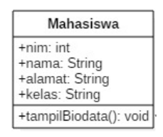
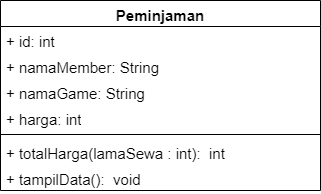
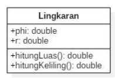
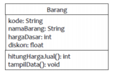

## Jobsheet 2
### Nama    : Andreagazy Iza Amerianto
### NIM     : 2241720146
### Kelas   : TI-2C

## Percobaan 1
Studi Kasus 1:
Dalam suatu perusahaan salah satu data yang diolah adalah data karyawan. Setiap karyawan memiliki id, nama, jenis kelamin, jabatan, dan gaji. Setiap mahasiswa juga bisa menampilkan data diri pribadi dan melihat gajinya.

1. Gambarkan desain class diagram dari studi kasus 1!,
    
    
2. Sebutkan Class apa saja yang bisa dibuat dari studi kasus 1!,
<br>class Karyawan

3. Sebutkan atribut beserta tipe datanya yang dapat diidentifikasi dari masing-masing class dari studi kasus 1!
<br>id : int
<br>nama : String
<br>jenisKelamin : String
<br>jabatan : String
<br>gaji : int

4. Sebutkan method-method yang sudah anda buat dari masing-masing class pada studi kasus 1!
<br> method tampilData dan method lihatGaji


## Percobaan 2
Studi Kasus 2:
Perhatikan class diagram dibawah ini. Buatlah program berdasarkan class diagram tersebut!

Langkah kerja:

1. Bukalah text editor atau IDE, misalnya Notepad ++ /netbeans.
2. Ketikkan kode program berikut ini:
```java
    public class Mahasiswa{
    public int nim;
    public String nama;
    public String alamat;
    public String kelas;

    public void tampilBiodata(){
        System.out.println("NIM : " + nim);
        System.out.println("Nama : " + nama);
        System.out.println("Alamat : " + alamat);
        System.out.println("Kelas : " + kelas);
    }
}

```
3. Simpan dengan nama file Mahasiswa.java.
4. Untuk dapat mengakses anggota-anggota dari suatu obyek, maka harus dibuat instance
dari class tersebut terlebih dahulu. Berikut ini adalah cara pengaksesan anggotaanggota dari class Mahasiswa dengan membuka file baru kemudian ketikkan kode
program berikut:
```java 
public class TestMahasiswa {
    public static void main(String[] args) {
        Mahasiswa mhs1 = new Mahasiswa();
        mhs1.nim=101;
        mhs1.nama="Andreagazy Iza A";
        mhs1.alamat="Jl. Kalpataru No 65B";
        mhs1.kelas= "2C";
        mhs1.tampilBiodata();
    }
```
5. Simpan file dengan TestMahasiswa.java
6. Jalankan class TestMahasiswa

7. Jelaskan pada bagian mana proses pendeklarasian atribut pada program diatas!
<br> proses pendeklarasian atribut terdapat pada bagian

    ```java
    public int nim;
    public String nama;
    public String alamat;
    public String kelas;
    ```
8. Jelaskan pada bagian mana proses pendeklarasian method pada program diatas!
<br>proses pendeklarasian method terdapat pada bagian
    ```java
        public void tampilBiodata(){
        System.out.println("NIM : " + nim);
        System.out.println("Nama : " + nama);
        System.out.println("Alamat : " + alamat);
        System.out.println("Kelas : " + kelas);
    }
    ``` 

9. Berapa banyak objek yang di instansiasi pada program diatas!
<br>terdapat 1 objek saja yang terinstansiasi yaitu mhs1

10. Apakah yang sebenarnya dilakukan pada sintaks program “mhs1.nim=101” ?
<br>Menambahkan nilai dari atribut nim pada objek mhs1

11. Apakah yang sebenarnya dilakukan pada sintaks program “mhs1.tampilBiodata()” ?
<br>Melakukan pemanggilan method objek mhs1 yang dimana menampilkan seluruh biodata(atribut) dari mhs1 

12. Instansiasi 2 objek lagi pada program diatas!
    ```java
    Mahasiswa mhs2 = new Mahasiswa();
    Mahasiswa mhs3 = new Mahasiswa();

    mhs2.nim=102;
    mhs2.nama="Achmad";
    mhs2.alamat="Jl. Kembang No 20";
    mhs2.kelas= "1F";
    mhs2.tampilBiodata();


    mhs3.nim=103;
    mhs3.nama="Irelda";
    mhs3.alamat="Jl. Chorus No 4D";
    mhs3.kelas= "1C";
    mhs3.tampilBiodata();
    ```

## Percobaan 3
Langkah kerja:
1. Bukalah text editor atau IDE, misalnya Notepad ++ / netbeans.
2. Ketikkan kode program berikut ini:
```java

public class Barang {
    public String namaBrg;
    public String jenisBrg;
    public int stok;

    public void tampilBarang(){
        System.out.println("Nama Barang : "+namaBrg);
        System.out.println("Jenis Barang : "+jenisBrg);
        System.out.println("Stok : "+stok);
    }
    //Method dengan argumen dan nilai balik(return)
    public int tambahStok(int brgMasuk){
        int stokBaru=brgMasuk+stok;
        return stokBaru;
    }
}

```

3. Simpan dengan nama file Barang.java
4. Untuk dapat mengakses anggota-anggota dari suatu obyek, maka harus dibuat instance
dari class tersebut terlebih dahulu. Berikut ini adalah cara pengaksesan anggotaanggota dari class Barang dengan membuka file baru kemudian ketikkan kode program
berikut:
```java
public class TestBarang {
    public static void main(String[] args) {
        Barang brg1 = new Barang();
        brg1.namaBrg="Pensil";
        brg1.jenisBrg="ATK";
        brg1.stok=10;
        brg1.tampilBarang();
    //menampilkan dan mengisi argumen untuk menambahkan stok barang
        System.out.println("Stok Baru adalah "+brg1.tambahStok(20));
    }    
}

```
5. Simpan dengan nama file TestBarang.java
6. Jalankan program tersebut!
7. Apakah fungsi argumen dalam suatu method?
Argumen berfungsu untuk memberikan data/nilai tambahan yang diperlukan oleh method tersebut.

8. Ambil kesimpulan tentang kegunaan dari kata kunci return , dan kapan suatu method
harus memiliki return!
Jika method tersebut memiliki tipe data dan method tersebut menghasilkan/menghitung nilai yang memiliki nilai yang dapat dikembalikan.

## Tugas
1. Suatu toko persewaan video game salah satu yang diolah adalah peminjaman, dimana data yang dicatat ketika ada orang yang melakukan peminjaman adalah id, nama member, nama game, dan harga yang harus dibayar. Setiap peminjaman bisa menampilkan data hasil peminjaman dan harga yang harus dibayar. Buatlah class diagram pada studi kasus diatas!
<br>
Penjelasan:
<ul>
<li>Harga yang harus dibayar diperoleh dari lama sewa x harga.
<li>Diasumsikan 1x transaksi peminjaman game yang dipinjam hanya 1 game saja.

2. Buatlah program dari class diagram yang sudah anda buat di no 1!
```java
public class Peminjaman {
    public int id,harga;
    public String namaMember, namaGame;

    public int totalHarga(int lamaSewa){
        int total = harga * lamaSewa;
        return total;
    }

    public void tampilData(){
        System.out.println("ID : "+id);
        System.out.println("Nama Member : "+namaMember);
        System.out.println("Nama Game : "+namaGame);
        System.out.println("Harga : "+harga);
    }
}

```
#### Demo : 
```java
public class PeminjamanDemo {
  public static void main(String[] args) {
        Peminjaman pnj1 = new Peminjaman();

        pnj1.id=1;
        pnj1.namaMember="Agzy";
        pnj1.namaGame="A Space for the Unbound";
        pnj1.harga =50000;
        pnj1.tampilData();
        System.out.println("Total Harga : "+pnj1.totalHarga(5));
    }
}
```
3. Buatlah program sesuai dengan class diagram berikut ini:
<br>

#### Program
```java
public class Lingkaran {
    public double phi, r;

    public double hitungLuas(){
        return phi*r*r;
    }

    public double hitungKeliling(){
        return 2*phi*r;
    }
}

```
#### Demo
```java
public class LingakaranDemo {
    public static void main(String[] args) {
        Lingkaran lkr1 = new Lingkaran();
        Lingkaran lkr2 = new Lingkaran();
        

        lkr1.phi=3.14;
        lkr1.r= 10;
        System.out.println("Luas Linkaran 1 : "+ lkr1.hitungLuas());
        System.out.println("Keliling Linkaran 1 : "+ lkr1.hitungKeliling());
        
        lkr2.phi=3.14;
        lkr2.r= 25;
        System.out.println("Luas Linkaran 1 : "+ lkr2.hitungLuas());
        System.out.println("Keliling Linkaran 1 : "+ lkr2.hitungKeliling());
        
        

    }
}

```

4. Buatlah program sesuai dengan class diagram berikut ini:
<br>

Deskripsi / Penjelasan :
<ul>
<li>Nilai atribut hargaDasar dalam Rupiah dan atribut diskon dalam %
<li>Method hitungHargaJual() digunakan untuk menghitung harga jual dengan perhitungan berikut ini:
<b>harga jual = harga dasar – (diskon x harga dasar)


#### Program
```java
public class Barang {
    public String kode, namaBarang;
    public int hargaDasar;
    public float diskon;

    public int hitungHargaJual(){
        int hargaJual =  hargaDasar - (int) ((diskon*hargaDasar)/100);
        return hargaJual;
    }

    public void tampilData(){
        System.out.println("Kode : "+kode);
        System.out.println("Nama Barang : "+namaBarang);
        System.out.println("Harga Dasar : "+hargaDasar);
        System.out.println("Diskon : "+diskon);
    }
}

```
#### Demo
```java
public class BarangDemo {
    public static void main(String[] args) {
        Barang brg1 = new Barang();
        brg1.kode = "B001";
        brg1.namaBarang = "Silverqueen";
        brg1.hargaDasar = 20000;
        brg1.diskon = 15;
        brg1.tampilData();
        System.out.println("Harga Jual : "+brg1.hitungHargaJual());
    }
}

```
