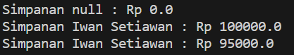

## Jobsheet 3

### Nama : Andreagazy Iza Amerianto

### NIM : 2241720146

### Kelas : TI-2C

## 3.1 Percobaan 1 - Enkapsulasi

Didalam percobaan enkapsulasi, buatlah class Motor yang memiliki atribut kecepatan dan kontakOn,
dan memiliki method printStatus() untuk menampilkan status motor. Seperti berikut

1. Buka Netbeans, buat project MotorEncapsulation.
2. Buat class Motor. Klik kanan pada package motorencapsulation – New – Java Class.
3. Ketikkan kode class Motor dibawah ini.

```java
package Percobaan1.MotorEncapsulation;

public class Motor {//Andreagazy Iza Amerianto
    public int kecepatan = 0;
    public boolean kontakOn = false;

    public void printStatus() {
        if (kontakOn == true) {
            System.out.println("Kontak On");
        } else {
            System.out.println("Kontak Off");
        }
        System.out.println("Kecepatan " + kecepatan + "\n");
    }
}
```

bentuk UML class diagram class Motor adalah sebagai berikut:
<br>

4. Kemudian buat class MotorDemo, ketikkan kode berikut ini

```java
package Percobaan1.MotorEncapsulation;

public class MotorDemo {//Andreagazy Iza Amerianto
    public static void main(String[] args) {
        Motor motor = new Motor();
        motor.printStatus();
        motor.kecepatan = 50;
        motor.printStatus();
    }
}
```

5. Hasilnya adalah sebagai berikut :
   <br>

## 3.2 Percobaan 2 - Access Modifier

Pada percobaan ini akan digunakan access modifier untuk memperbaiki cara kerja class Motor pada
percobaan ke-1.

1. Ubah cara kerja class motor sesuai dengan UML class diagram berikut.
   <br>

2. Berdasarkan UML class diagram tersebut maka class Motor terdapat perubahan, yaitu:
   <ol type="a">
   <li>Ubah access modifier kecepatan dan kontakOn menjadi private.
   <li>Tambahkan method nyalakanMesin, matikanMesin, tambahKecepatan, kurangiKecepatan.</ol>
   Implementasi class Motor adalah sebagai berikut:

```java
    package Percobaan2.MotorEncapsulation;
public class Motor {//Andreagazy Iza Amerianto
    private int kecepatan = 0;
    private boolean kontakOn = false;

    public void nyalakanMesin() {
        kontakOn = true;
    }
    public void matikanMesin() {
        kontakOn = false;
        kecepatan = 0;
    }
    public void tambahKecepatan() {
        if (kontakOn == true) {
            kecepatan += 5;
        } else {
            System.out.println("Kecepatan tidak bisa bertambah karena Mesin Off! \n");
        }
    }
    public void kurangiKecepatan(){
        if (kontakOn == true) {
            kecepatan -= 5;
        } else {
            System.out.println("Kecepatan tidak bisa bertambah karena Mesin Off! \n");
        }
    }
    public void printStatus() {
        if (kontakOn == true) {
            System.out.println("Kontak On");
        } else {
            System.out.println("Kontak Off");
        }
        System.out.println("Kecepatan : " + kecepatan + "\n");
    }
}
```

3. Kemudian pada class MotorDemo, ubah code menjadi seperti berikut:

```java
package Percobaan2.MotorEncapsulation;

public class MotorDemo {//Andreagazy Iza Amerianto
    public static void main(String[] args) {
        Motor motor = new Motor();
        motor.printStatus();
        motor.tambahKecepatan();

        motor.nyalakanMesin();
        motor.printStatus();

        motor.tambahKecepatan();
        motor.printStatus();

        motor.tambahKecepatan();
        motor.printStatus();

        motor.tambahKecepatan();
        motor.printStatus();

        motor.matikanMesin();
        motor.printStatus();
    }
}
```

4. Hasilnya dari class MotorDemo adalah sebagai berikut:
   <br>

Dari percobaan diatas, dapat kita amati sekarang atribut kecepatan tidak bisa diakses oleh pengguna dan diganti nilainya secara sembarangan. Bahkan ketika mencoba menambah kecepatan saat posisi kontak masih OFF, maka akan muncul notifikasi bahwa mesin OFF. Untuk mendapatkan kecepatan yang diinginkan, maka harus dilakukan secara gradual, yaitu dengan memanggil method tambahKecepatan() beberapa kali. Hal ini mirip seperti saat kita mengendarai motor.

## 3.3 Pertanyaan

1. Pada class MotorDemo, saat kita menambah kecepatan untuk pertama kalinya, mengapa muncul peringatan “Kecepatan tidak bisa bertambah karena Mesin Off!”?
   Karena pada saat itu kontakOn = false; dan dalam method tambahKecepatan() terdapat if else

```java
public void tambahKecepatan() {
        if (kontakOn == true) {
            kecepatan += 5;
        } else {
            System.out.println("Kecepatan tidak bisa bertambah karena Mesin Off! \n");
        }
    }
```

yang menyebabkan kecepatan tidak bisa bertambah.

2. Mengapa atribut kecepatan dan kontakOn diset private?
   Agar atribut kecepatan dan kontakOn hanya dapat diakses oleh class Motor saja.
3. Ubah class Motor sehingga kecepatan maksimalnya adalah 100!

Menambahkan atribut

```java
private int kecepatanMax = 100;
```

dan juga menambahkan pemilihan pada method tambahKecepatan()

```java
public void tambahKecepatan() {
        if (kontakOn == true) {
            kecepatan += 5;
            if (kecepatan>kecepatanMax) {
                kecepatan=kecepatanMax;
            }
        } else {
            System.out.println("Kecepatan tidak bisa bertambah karena Mesin Off! \n");
        }
    }
```

## 3.4 Percobaan 3 - Getter dan Setter

Misalkan di sebuah sistem informasi koperasi, terdapat class Anggota. Anggota memiliki atribut
nama, alamat dan simpanan, dan method setter, getter dan setor dan pinjam. Semua atribut pada
anggota tidak boleh diubah sembarangan, melainkan hanya dapat diubah melalui method setter,
getter, setor dan tarik. Khusus untuk atribut simpanan tidak terdapat setter karena simpanan akan
bertambah ketika melakukan transaksi setor dan akan berkurang ketika melakukan
peminjaman/tarik.

1. Berikut ini UML class buatlah class Mahasiswa pada program:
   <br>

2. Sama dengan percobaan 1 untuk membuat project baru
<ol type="a">
<li>Buka Netbeans, buat project KoperasiGetterSetter.
<li>Buat class Anggota. Klik kanan pada package koperasigettersetter – New – Java Class.
<li>Ketikkan kode class Anggota dibawah ini </ol>

```java
package Percobaan3.KoperasiGetterSetter;
public class Anggota {//Andreagazy Iza Amerianto
    private String nama, alamat;
    private float simpanan;

    public void setNama(String nama) {
        this.nama = nama;
    }
    public void setAlamat(String alamat) {
        this.alamat = alamat;
    }
    public String getNama() {
        return nama;
    }
    public String getAlamat() {
        return alamat;
    }
    public float getSimpanan() {
        return simpanan;
    }
    public void setor(float uang){
        simpanan +=uang;
    }
    public void pinjam(float uang){
        simpanan -= uang;
    }
}
```

Jika diperhatikan pada class Anggota, atribut nama dan alamat memili masing-masing 1 getter dan setter. Sedangkan atribut simpanan hanya memiliki getSimpanan() saja, karena seperti tujuan awal, atribut simpanan akan berubah nilainya jika melakukan transaksi setor() dan pinjam/tarik().

3. Selanjutnya buatlah class KoperasiDemo untuk mencoba class Anggota :

```java
package Percobaan3.KoperasiGetterSetter;

public class KoperasiDemo {//Andreagazy Iza Amerianto
    public static void main(String[] args) {
        Anggota anggota1= new Anggota();
        anggota1.setNama("Iwan Setiawan");
        anggota1.setAlamat("Jalan Sukarno Hatta no 10");
        anggota1.setor(100000);
        System.out.println("Simpanan "+anggota1.getNama()+" : Rp "+anggota1.getSimpanan());

        anggota1.pinjam(5000);
        System.out.println("Simpanan "+anggota1.getNama()+" : Rp "+anggota1.getSimpanan());
    }
}
```

4. Hasil dari main method pada langkah ketiga adalah
   <br>

## 3.5 Percobaan 4 - Konstruktor, Instansiasi

1. Langkah pertama percobaan 4 adalah ubah class KoperasiDemo seperti berikut

```java
package Percobaan4.KoperasiGetterSetter;

public class KoperasiDemo {//Andreagazy Iza Amerianto
    public static void main(String[] args) {
        Anggota anggota1= new Anggota();
        System.out.println("Simpanan "+anggota1.getNama()+" : Rp "+anggota1.getSimpanan());

        anggota1.setNama("Iwan Setiawan");
        anggota1.setAlamat("Jalan Sukarno Hatta no 10");
        anggota1.setor(100000);
        System.out.println("Simpanan "+anggota1.getNama()+" : Rp "+anggota1.getSimpanan());
        anggota1.pinjam(5000);
        System.out.println("Simpanan "+anggota1.getNama()+" : Rp "+anggota1.getSimpanan());
    }
}
```

2. Hasil dari program tersebut adalah sebagai berikut.
   <br>

Dapat dilihat hasil running program, ketika dilakukan pemanggilan method getNama()
hasilnya hal ini terjadi karena atribut nama belum diset nilai defaultnya. Hal ini dapat
ditangani dengan membuat kontruktor.

3. Ubah class Anggota menjadi seperti berikut

```java
package Percobaan4.KoperasiGetterSetter;

public class Anggota {//Andreagazy Iza Amerianto
    private String nama, alamat;
    private float simpanan;

    Anggota(String nama, String alamat){
        this.nama=nama;
        this.alamat=alamat;
        this.simpanan=0;
    }

    public void setNama(String nama) {
        this.nama = nama;
    }
    public void setAlamat(String alamat) {
        this.alamat = alamat;
    }
    public String getNama() {
        return nama;
    }
    public String getAlamat() {
        return alamat;
    }
    public float getSimpanan() {
        return simpanan;
    }
    public void setor(float uang){
        simpanan +=uang;
    }
    public void pinjam(float uang){
        simpanan -= uang;
    }
}
```

Pada class Anggota dibuat kontruktor dengan access modifier default yang memiliki 2
parameter nama dan alamat. Dan didalam konstruktor tersebut dipastikan nilai simpanan
untuk pertama kali adalah Rp. 0.

4. Selanjutnya ubah class KoperasiDemo sebagai berikut

```java
package Percobaan4.KoperasiGetterSetter;

public class KoperasiDemo {//Andreagazy Iza Amerianto
    public static void main(String[] args) {
        Anggota anggota1= new Anggota("Iwan","Jalan Mawar");
        System.out.println("Simpanan "+anggota1.getNama()+" : Rp "+anggota1.getSimpanan());
        anggota1.setNama("Iwan Setiawan");
        anggota1.setAlamat("Jalan Sukarno Hatta no 10");
        anggota1.setor(100000);

        System.out.println("Simpanan "+anggota1.getNama()+" : Rp "+anggota1.getSimpanan());

        anggota1.pinjam(5000);
        System.out.println("Simpanan "+anggota1.getNama()+" : Rp "+anggota1.getSimpanan());
    }

}

```

5. Hasil dari program tersebut adalah sebagai berikut
   <br>

Setelah menambah konstruktor pada class Anggoata maka atribut nama dan alamat secara
otomatis harus diset terlebih dahulu dengan melakukan passing parameter jika melakukan
instansiasi class Anggota. Hal ini biasa dilakukan untuk atribut yang membutuhkan nilai yang
spesifik. Jika tidak membutuhkan nilai spesifik dalam konstruktor tidak perlu parameter.
Contohnya simpanan untuk anggota baru diset 0, maka simpanan tidak perlu untuk dijadikan
parameter pada konstruktor.

## 3.6 Pertanyaan – Percobaan 3 dan 4

1. Apa yang dimaksud getter dan setter?
   Getter adalah public method dan memiliki tipe data return, yang berfungsi untuk mendapatkan nilai
   dari atribut private. sedangkan setter adalah public method yang berfungsi untuk memanipulasi nilai dari atribut private.
2. Apa kegunaan dari method getSimpanan()?
   method getSimpanan() digunakan untuk mendapat nilai dari atribut simpanan yang di private
3. Method apa yang digunakan untk menambah saldo?
   yang digunakan untuk menambah saldo adalah method setor()
4. Apa yand dimaksud konstruktor?
   Konstruktor adalah mirip method yang menginisialisasi atribut yang akan dimiliki oleh objek. Namun, nama konstruktor harus sama dengan nama class

5. Sebutkan aturan dalam membuat konstruktor?
<ol><li>Nama konstruktor harus sama dengan nama class
<li>Konstruktor tidak memiliki tipe data return
<li>Konstruktor tidak boleh menggunakan modifier abstract, static, final, dan syncronized
</ol>

6. Apakah boleh konstruktor bertipe private?
   Boleh, tapi nantinya konstruktor tersebut hanya bisa digunakan di class itu saja sehingga lebih baik kosntruktor menggunakan
7. Kapan menggunakan parameter dengan passsing parameter?
   passing parameter digunakan saat melakukan instansiasi pada main yang dimana untuk mempermudah melakukan instanisiasi atribut pada objek yang dibuat.
8. Apa perbedaan atribut class dan instansiasi atribut?
   atribut class adalah sebuah atribut yang dimiliki oleh suatu class, sedangkan instansiasi atribut merupakan disaat class sebelumnya dijadikan objek dan atribut dari class tersebut diberikan nilai/digunakan pada class lain misal pada class main.
9. Apa perbedaan class method dan instansiasi method?
   class method adalah sebuah method/fungsi yang dimiliki oleh suatu class, sedangkan instansiasi method adalah disaat class lain membuat objek dari class tersebut dan menggunakan fungsi/method dari class tersebut untuk objek yang telah dibuat

## Tugas

1. Cobalah program dibawah ini dan tuliskan hasil outputnya
   <br>
   <br><b>EncapDemo.java</b>

```java
package Tugas.Tugas1;

public class EncapDemo {//Andreagazy Iza Amerianto
    private String name;
    private int age;

    public String getName() {
        return name;
    }
    public void setName(String newName) {
        name = newName;
    }
    public int getAge() {
        return age;
    }
    public void setAge(int newAge) {
        if (newAge>30) {
            age = 30;
        }else{

            age = newAge;
        }
    }
}

```

<br><b>EncapTest.java</b>

<br><b>Class EncapTest</b>
<br>

```java
package Tugas.Tugas1;

public class EncapTest {//Andreagazy Iza Amerianto
    public static void main(String[] args) {
        EncapDemo encap = new EncapDemo();
        encap.setName("James");
        encap.setAge(35);

        System.out.println("Name : "+ encap.getName());
        System.out.println("Age : "+ encap.getAge());
    }
}

```

2. Pada program diatas, pada class EncapTest kita mengeset age dengan nilai 35, namun pada saat ditampilkan ke layar nilainya 30, jelaskan mengapa.
   <br>Jawaban : Karena pada method setAge() terdapat pemilihan if yang dimana menyebabkan jika Age yang di inputkan lebih dari 30 maka Age akan menjadi 30

```java
    public void setAge(int newAge) {//Andreagazy Iza Amerianto
        if (newAge>30) {
            age = 30;
        }else{

            age = newAge;
        }
    }
```

3. Ubah program diatas agar atribut age dapat diberi nilai maksimal 30 dan minimal 18.

```java
public void setAge(int newAge) {
        if (newAge>30) {
            age = 30;
        }else if (age<18) {
            age= 18;
        }else{
            age = newAge;
        }
    }
```

<b>Main</b>

```java
package Tugas.Tugas1;

public class EncapTest {
    public static void main(String[] args) {
        EncapDemo encap = new EncapDemo();
        encap.setName("James");
        encap.setAge(17);

        System.out.println("Name : "+ encap.getName());
        System.out.println("Age : "+ encap.getAge());
    }
}

```

<b>Hasil</b>

<br>

4. Pada sebuah sistem informasi koperasi simpan pinjam, terdapat class Anggota yang memiliki atribut antara lain nomor KTP,nama, limit peminjaman, dan jumlah pinjaman. Anggota dapat meminjam uang dengan batas limit peminjaman yang ditentukan. Anggota juga dapat mengangsur pinjaman. Ketika Anggota tersebut mengangsur pinjaman, maka jumlah pinjaman akan berkurang sesuai dengan nominal yang diangsur. Buatlah class Anggota tersebut, berikan atribut, method dan konstruktor sesuai dengan kebutuhan. Uji dengan TestKoperasi berikut ini untuk memeriksa apakah class Anggota yang anda buat telah sesuai dengan yang diharapkan.

<b>Class Anggota</b>
<br>

```java
package Tugas.Tugas4;

public class Anggota {
    private String noKtp, nama;
    private int limitPinjaman, jumlahPinjaman;

    Anggota(String noKtp, String nama,int limitPinjaman){
        this.noKtp=noKtp;
        this.nama=nama;
        this.limitPinjaman=limitPinjaman;
        jumlahPinjaman=0;
    }
    public String getNoKtp() {
    return noKtp;
    }
    public String getNama() {
        return nama;
    }
    public int getLimitPinjaman() {
        return limitPinjaman;
    }
    public int getJumlahPinjaman() {
        return jumlahPinjaman;
    }
    public void pinjam(int jumlah){
        if (jumlah>limitPinjaman) {
            System.out.println("Maaf, jumlah peminjaman melebihi limit");
        }else{
            jumlahPinjaman+=jumlah;
        }
    }

    public void angsur(int jumlah){
        jumlahPinjaman-=jumlah;
        if (jumlahPinjaman<0) {
            System.out.println("Anda memiliki kembalian "+ Math.abs(jumlahPinjaman));
            jumlahPinjaman=0;
        }
    }
}

```

<b>Main</b>

```java
package Tugas.Tugas4;

public class TestKoperasi {
    public static void main(String[] args) {
        Anggota donny = new Anggota("111333444","Donny", 5000000);

        System.out.println("Nama Anggota : "+ donny.getNama());
        System.out.println("Limit Pinjaman : "+donny.getLimitPinjaman());

        System.out.println("\nMeminjam uang 10.000.000");
        donny.pinjam(10000000);
        System.out.println("Jumlah pinjaman saat ini: "+donny.getJumlahPinjaman());

        System.out.println("\nMeminjam uang 4.000.000");
        donny.pinjam(4000000);
        System.out.println("Jumlah pinjaman saat ini: "+donny.getJumlahPinjaman());

        System.out.println("\nMembayar uang 1.000.000");
        donny.angsur(1000000);
        System.out.println("Jumlah pinjaman saat ini: "+donny.getJumlahPinjaman());

        System.out.println("\nMembayar uang 3.000.000");
        donny.angsur(3000000);
        System.out.println("Jumlah pinjaman saat ini: "+donny.getJumlahPinjaman());
    }
}

```

<b>Hasil</b>

<br>

5. Modifikasi soal no. 4 agar nominal yang dapat diangsur minimal adalah 10% dari jumlah
   pinjaman saat ini. Jika mengangsur kurang dari itu, maka muncul peringatan “Maaf,
   angsuran harus 10% dari jumlah pinjaman".

<b>Kode yang dimodifikasi</b>

```java
public void angsur(int jumlah){//Andreagazy Iza Amerianto
        if (jumlah<(this.jumlahPinjaman*10/100)) {
            System.out.println("Maaf, angsuran harus 10% dari jumlah pinjaman");
        }else{
            jumlahPinjaman-=jumlah;
            if (jumlahPinjaman<0) {
                System.out.println("Anda memiliki kembalian "+ Math.abs(jumlahPinjaman));
                jumlahPinjaman=0;
            }
        }
    }
```

<b>Main</b>

```java
package Tugas.Tugas5;

public class TestKoperasi {//Andreagazy Iza Amerianto
    public static void main(String[] args) {
        Anggota donny = new Anggota("111333444","Donny", 5000000);

        System.out.println("Nama Anggota : "+ donny.getNama());
        System.out.println("Limit Pinjaman : "+donny.getLimitPinjaman());

        System.out.println("\nMeminjam uang 10.000.000");
        donny.pinjam(10000000);
        System.out.println("Jumlah pinjaman saat ini: "+donny.getJumlahPinjaman());

        System.out.println("\nMeminjam uang 4.000.000");
        donny.pinjam(4000000);
        System.out.println("Jumlah pinjaman saat ini: "+donny.getJumlahPinjaman());

        System.out.println("\nMembayar uang 100.000");
        donny.angsur(100000);
        System.out.println("Jumlah pinjaman saat ini: "+donny.getJumlahPinjaman());

        System.out.println("\nMembayar uang 3.000.000");
        donny.angsur(3000000);
        System.out.println("Jumlah pinjaman saat ini: "+donny.getJumlahPinjaman());
    }
}

```

<b>Hasil</b>

<br>

6. Modifikasi class TestKoperasi, agar jumlah pinjaman dan angsuran dapat menerima input
   dari console.

<b>Kode yang dimodifikasi</b>

```java
package Tugas.Tugas6;

import java.util.Scanner;

public class TestKoperasi {// Andreagazy Iza Amerianto
    public static void main(String[] args) {
        Scanner sc = new Scanner(System.in);
        char check = 't';
        Anggota donny = new Anggota("111333444", "Donny", 5000000);


        System.out.println("Nama Anggota : "+ donny.getNama());
        System.out.println("Limit Pinjaman : "+donny.getLimitPinjaman());

        do {
            System.out.print("Masukkan pinjaman : ");
            int jmlhPinjam = sc.nextInt();
            sc.nextLine();
            donny.pinjam(jmlhPinjam);
            System.out.println("Jumlah pinjaman saat ini: " + donny.getJumlahPinjaman());
            System.out.println();
            System.out.println("Apakah ingin meminjam lagi?(y/t)");
            check = sc.next().charAt(0);
            sc.nextLine();
        } while (check == 'y' || check == 'Y');

        do {
            System.out.print("Masukkan angsuran : ");
            int jmlhAngsur = sc.nextInt();
            sc.nextLine();
            donny.angsur(jmlhAngsur);
            System.out.println("Jumlah pinjaman saat ini: " + donny.getJumlahPinjaman());
            System.out.println();
            System.out.println("Apakah ingin melakukan angsuran lagi?(y/t)");
            check = sc.next().charAt(0);
            sc.nextLine();
        } while (check == 'y' || check == 'Y');
    }
}
```
