## Jobsheet 4

### Nama : Andreagazy Iza Amerianto

### NIM : 2241720146

### Kelas : TI-2C

## Percobaan 1  
<ol type="a">
<li>Perhatikan diagram class berikut:
<br>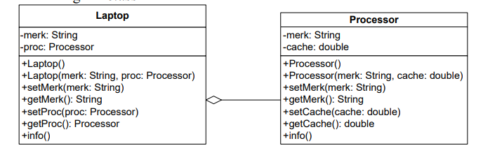
<li>. Buka project baru di Netbeans dan buat package dengan format berikut:
identifier .relasiclass.percobaan1 (ganti identifier dengan 
identitas anda atau nama domain), Contoh: ac.id.polinema, jti.polinema, dan 
sebagainya).
<li>Buatlah class Processor dalam package tersebut.

<br><b>Keseluruhan Class Processor</b>

```java 
package Pertemuan4.Percobaan1;

public class Processor {
    private String merk;
    private double cache;

    public Processor(){

    };
    public Processor(String merk, double cache) {
        this.merk = merk;
        this.cache = cache;
    }

    public void setMerk(String merk) {
        this.merk = merk;
    }

    public String getMerk() {
        return merk;
    }

    public void setCache(double cache) {
        this.cache = cache;
    }

    public double getCache() {
        return cache;
    }

    public void info() {
        System.out.printf("Merk Processor = %s\n", merk);
        System.out.printf("Cache Memory = %.2f\n", cache);
    }
}
```

<li>Kemudian buatlah class Laptop di dalam package yang telah anda buat.
<br><b>Keseluruhan Class Laptop</b>

```java
package Pertemuan4.Percobaan1;
public class Laptop {
    private String merk;
    private Processor proc;

    public Laptop(){
        
    };

    Laptop (String merk, Processor proc){
        this.merk=merk;
        this.proc=proc;
    }
    public void setMerk(String merk) {
        this.merk = merk;
    }
    public String getMerk() {
        return merk;
    }
    public void setProc(Processor proc) {
        this.proc = proc;
    }
    public Processor getProc() {
        return proc;
    }
    public void info() {
        System.out.println("Merk Laptop = " + merk);
        proc.info();
        }
        
}

```

<li>Pada package yang sama, buatlah class MainPercobaan1 yang berisi method main().
<br><b>Main</b>

```java
package Pertemuan4.Percobaan1;

public class MainPercobaan1 {
    public static void main(String[] args) {
        Processor p = new Processor("Intel i5", 3);
        Laptop L = new Laptop("Thinkpad", p);
        L.info();
        Processor p1 = new Processor();
        p1.setMerk("Intel i5");
        p1.setCache(4);
        Laptop L1 = new Laptop();
        L1.setMerk("Thinkpad");
        L1.setProc(p1);
        L1.info();
    }
}

```

<li>Compile kemudian run class MainPercobaan1, akan didapatkan hasil seperti berikut:
<br>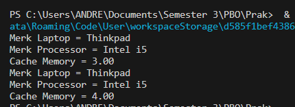

</ol>

## Pertanyaan 
1. Di dalam class Processor dan class Laptop , terdapat method setter dan getter untuk masing‑masing atributnya. Apakah gunanya method setter dan getter tersebut ?
    Method Getter berfungsi untuk mendapatkan nilai dari atribut private. sedangkan setter berfungsi untuk memanipulasi nilai dari atribut private.
2. Di dalam class Processor dan class Laptop, masing‑masing terdapat konstruktor default dan konstruktor berparameter. Bagaimanakah beda penggunaan dari kedua jenis konstruktor tersebut ?
    Penggunaan konstruktor default adalah dimana semua atribut akan bernilai null jika konstruktor tersebut dibuat sehingga kita perlu melakukan pemanggilan method setter untuk memberikan nilai pada atribut. Namun pada konstruktor berparameter kita tidak perlu melakukan pemanggilan method setter karena atribut telah diberikan nilai pada parameter yang telah dimasukkan 
3. Perhatikan class Laptop, di antara 2 atribut yang dimiliki (merk dan proc), atribut manakah yang bertipe object ?
    atribut yang bertipe object adalah proc karena atribut tersebut diambil dari class processor
4. Perhatikan class Laptop, pada baris manakah yang menunjukan bahwa class Laptop memiliki relasi dengan class Processor ?
    pada baris
    ```java
    private Processor proc;
    ```
    yang dimana terdapat sebuah atribut dalam class Laptop dengan nama proc yang memiliki tipe data Processor yang menunjukkan bahwa class Laptop memiliki sebuah objek yang merupakan instansiasi dari class Processor.
5. Perhatikan pada class Laptop , Apakah guna dari sintaks proc.info() ?
    sintaks proc.info() merupakan method yang digunakan untuk menampilkan atribut dari object proc yang telah dibuat.
6. Pada class MainPercobaan1, terdapat baris kode:
Laptop l = new Laptop("Thinkpad", p);.
Apakah p tersebut ? p tersebut adalah sebuah object Processor yang telah dibuat sebelumnya dan menjadi parameter pada saat melakukan instanisai objek Laptop l
<br>Dan apakah yang terjadi jika baris kode tersebut diubah menjadi:
Laptop l = new Laptop("Thinkpad", new Processor("Intel i5", 3));
Bagaimanakah hasil program saat dijalankan, apakah ada perubahan ? hasilnya sama dan tidak ada perubahan.

## Percobaan 2
<b>Perhatikan diagram class berikut yang menggambarkan sistem rental mobil. Pelanggan bisa menyewa mobil sekaligus sopir. Biaya sopir dan biaya sewa mobil dihitung per hari</b>
<ol type="a">
<br>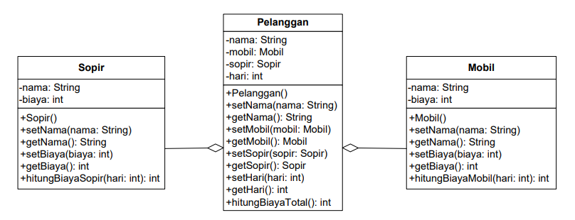
<li>Buatlah class Mobil di dalam package tersebut
<br><b>Class Mobil</b>

```java
package Pertemuan4.Percobaan2;

public class Mobil {
    private String merk;
    private int biaya;
    public Mobil(){

    }
    public void setMerk(String merk) {
        this.merk = merk;
    }
    public String getMerk() {
        return merk;
    }
    public void setBiaya(int biaya) {
        this.biaya = biaya;
    }
    public int getBiaya() {
        return biaya;
    }
    public int hitungBiayaMobil(int hari) {
        return biaya * hari;
        }
}

```
<li>Tambahkan class Sopir dengan atribut nama tipe String dan biaya tipe int dengan akses modifier private berikut dengan constructor default.
<br><b>Class Supir</b>

```java
package Pertemuan4.Percobaan2;

public class Sopir {
    private String nama;
    private int biaya;
    public Sopir(){

    }
    public void setNama(String nama) {
        this.nama = nama;
    }
    public String getNama() {
        return nama;
    }
    public void setBiaya(int biaya) {
        this.biaya = biaya;
    }
    public int getBiaya() {
        return biaya;
    }
    public int hitungBiayaSopir(int hari) {
        return biaya * hari;
        }
}

```

<li>Tambahkan class Pelanggan dengan constructor default.
<br><b>Class Pelanggan</b>

```java
package Pertemuan4.Percobaan2;

public class Pelanggan {
    private String nama;
    private Mobil mobil;
    private Sopir sopir;
    private int hari;

    public Pelanggan() {

    }

    public void setNama(String nama) {
        this.nama = nama;
    }

    public String getNama() {
        return nama;
    }

    public void setMobil(Mobil mobil) {
        this.mobil = mobil;
    }

    public Mobil getMobil() {
        return mobil;
    }

    public void setSopir(Sopir sopir) {
        this.sopir = sopir;
    }

    public Sopir getSopir() {
        return sopir;
    }

    public void setHari(int hari) {
        this.hari = hari;
    }

    public int getHari() {
        return hari;
    }

    public int hitungBiayaTotal() {
        return mobil.hitungBiayaMobil(hari) +
                sopir.hitungBiayaSopir(hari);
    }
    
}
```

<li>Buatlah class MainPercobaan2 yang berisi method main().
<br><b>Main</b>

```java
package Pertemuan4.Percobaan2;

public class MainPercobaan2 {
    public static void main(String[] args) {
        Mobil m = new Mobil();
        m.setMerk("Avanza");
        m.setBiaya(350000);
        Sopir s = new Sopir();
        s.setNama("John Doe");
        s.setBiaya(200000);
        Pelanggan p = new Pelanggan();
        p.setNama("Jane Doe");
        p.setMobil(m);
        p.setSopir(s);
        p.setHari(2);
        System.out.println("Biaya Total = " + p.hitungBiayaTotal());
    }

}

```

<br><b>Hasil</b>
<br>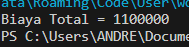

</ol>

## Pertanyaan
1. Perhatikan class Pelanggan. Pada baris program manakah yang menunjukan bahwa clas Pelanggan memiliki relasi dengan class Mobil dan class Sopir ?
<br>pada baris

```java
    private Mobil mobil;
    private Sopir sopir;
```
2. Perhatikan method hitungBiayaSopir pada class Sopir, serta method hitungBiayaMobil pada class Mobil. Mengapa menurut Anda method tersebut harus memiliki argument hari ?
<br>Karena harga yang dimiliki class Mobil dan Supir adalah harian sehingga diperlukan argument hari adalah untuk menghitung biaya dengan mengkalikan biaya dan hari.

3. Perhatikan kode dari class Pelanggan. Untuk apakah perintah mobil.hitungBiayaMobil(hari) dan sopir.hitungBiayaSopir(hari) ?
<br>Method mobil.hitungBiayaMobil(hari) digunakan untuk menghitung harga rental dari mobil berdasarkan lama hari dan sama juga dengan sopir.hitungBiayaSopir(hari).

4. Perhatikan class MainPercobaan2. Untuk apakah sintaks p.setMobil(m) dan p.setSopir(s) ?
<br>sintaks p.setMobil(m) digunakan untuk melakukan pemberian nilai pada atribut yang dimiliki pelanggan p yaitu Mobil berupa objek Mobil m yang telah diinstansiasikan nilai atributnya. sintaks p.setSopir(s) digunakan untuk pemberian nilai pada atribut yang dimiliki pelanggan p berupa objek Sopir s yang telah diinstansiasikan nilai atributnya.

5. Perhatikan class MainPercobaan2. Untuk apakah proses p.hitungBiayaTotal() tersebut ?
<br>Untuk menghitung biaya keseluruhan yang dirental yaitu mobil.hitungBiayaMobil(hari) + sopir.hitungBiayaSopir(hari)

6. Perhatikan class MainPercobaan2, coba tambahkan pada baris terakhir dari method main dan amati perubahan saat di‑run!
<br>System.out.println(p.getMobil().getMerk());
Jadi untuk apakah sintaks p.getMobil().getMerk() yang ada di dalam method main tersebut?
<br>Sintaks tersebut digunakan untuk memunculkan nilai dari atribut merk pada object Mobil m yang dimiliki oleh object Pelanggan p
<br><b>Hasil : </b>
<br>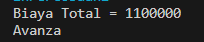

## Percobaan 3
<b>Sebuah Kereta Api dioperasikan oleh Masinis serta seorang Asisten Masinis. Baik Masinis 
maupun Asisten Masinis keduanya merupakan Pegawai PT. Kereta Api Indonesia. Dari 
ilustrasi cerita tersebut, dapat digambarkan dalam diagram kelas sebagai berikut:
</b>
<br>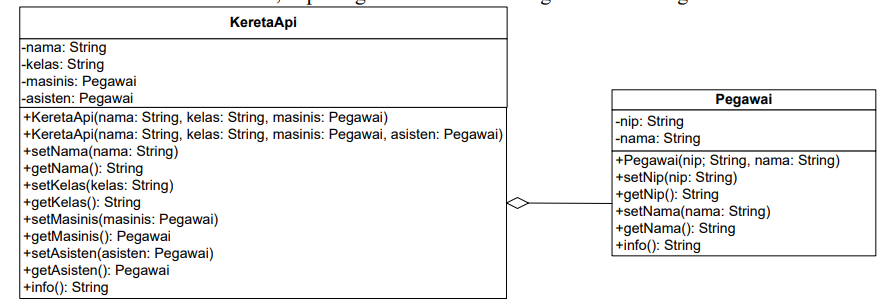
<ol type="a">
<li>Tambahkan class Pegawai.
<br><b>Class Pegawai</b>

```java
package Pertemuan4.Percobaan3;

public class Pegawai {
    private String nip, nama;

    public Pegawai(String nip, String nama) {
        this.nip = nip;
        this.nama = nama;
    }

    public void setNip(String nip) {
        this.nip = nip;
    }

    public String getNip() {
        return nip;
    }

    public void setNama(String nama) {
        this.nama = nama;
    }

    public String getNama() {
        return nama;
    }

    public String info() {
        String info = "";
        info += "Nip: " + this.nip + "\n";
        info += "Nama: " + this.nama + "\n";
        return info;
    }

}
```

<li>Buatlah class KeretaApi berdasarkan diagram class.
<br><b>Class Kereta Api</b>

```java
package Pertemuan4.Percobaan3;

public class KeretaApi {
    private String nama, kelas;
    private Pegawai masinis, asisten;
    public KeretaApi(String nama, String kelas, Pegawai masinis){
        this.nama = nama;
        this.kelas = kelas;
        this.masinis = masinis;
    }
    public KeretaApi(String nama, String kelas, Pegawai masinis, Pegawai asisten){
        this.nama = nama;
        this.kelas = kelas;
        this.masinis = masinis;
        this.asisten = asisten;
    }
    public void setNama(String nama) {
        this.nama = nama;
    }
    public String getNama() {
        return nama;
    }
    public void setKelas(String kelas) {
        this.kelas = kelas;
    }
    public String getKelas() {
        return kelas;
    }
    public void setMasinis(Pegawai masinis) {
        this.masinis = masinis;
    }
    public Pegawai getMasinis() {
        return masinis;
    }
    public void setAsisten(Pegawai asisten) {
        this.asisten = asisten;
    }
    public Pegawai getAsisten() {
        return asisten;
    }
    public String info() {
        String info = "";
        info += "Nama: " + this.nama + "\n";
        info += "Kelas: " + this.kelas + "\n";
        info += "Masinis: " + this.masinis.info() + "\n";
        info += "Asisten: " + this.asisten.info() + "\n";
        return info;
    }
}
```
<li>Buatlah sebuah class MainPercobaan3 dalam package yang sama.
<br><b>Main</b>

```java
package Pertemuan4.Percobaan3;

public class MainPercobaan3{
    public static void main(String[] args) {
    Pegawai masinis = new Pegawai("1234", "Spongebob Squarepants");
    Pegawai asisten = new Pegawai("4567", "Patrick Star");
    KeretaApi keretaApi = new KeretaApi("Gaya Baru", "Bisnis",masinis, asisten);
    
    System.out.println(keretaApi.info());
        
    }
}

```
<br><b>Hasil</b>
<br>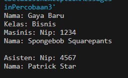
</ol>

## Pertanyaan
1. Di dalam method info() pada class KeretaApi, baris this.masinis.info() dan this.asisten.info() digunakan untuk apa ?
<br>this.masinis.info() dan this.asisten.info() digunakan untuk menampilkan atribut dari objek masinis dan asisten.

2. Buatlah main program baru dengan nama class MainPertanyaan pada package yang sama. Tambahkan kode berikut pada method main() !
<br>Pegawai masinis = new Pegawai("1234", "Spongebob Squarepants");
<br>KeretaApi keretaApi = new KeretaApi("Gaya Baru", "Bisnis", masinis);
<br>System.out.println(keretaApi.info());

```java
package Pertemuan4.Percobaan3;

public class MainPertanyaan {
    public static void main(String[] args) {
        Pegawai masinis = new Pegawai("1234", "Spongebob Squarepants");
        KeretaApi keretaApi = new KeretaApi("Gaya Baru", "Bisnis", masinis);
        System.out.println(keretaApi.info());
    }
}

```

3. Apa hasil output dari main program tersebut ? Mengapa hal tersebut dapat terjadi ?
<br>Terjadi error, karena nilai dari atribut asisten pada keretaApi adalah null sehingga ketika dilakukan pemanggilan method info tidak bisa muncul
<br>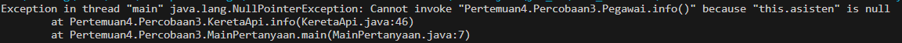

4. Perbaiki class KeretaApi sehingga program dapat berjalan !
<br>Agar dapat berjalan method info pada class tersebut harus ditambahkan

```java
public String info() {
        String info = "";
        if(this.asisten!=null){//Andreagazy Iza Amerianto
            info += "Nama: " + this.nama + "\n";
            info += "Kelas: " + this.kelas + "\n";
            info += "Masinis: " + this.masinis.info() + "\n";
            info += "Asisten: " + this.asisten.info() + "\n";
        }else{
            info += "Nama: " + this.nama + "\n";
            info += "Kelas: " + this.kelas + "\n";
            info += "Masinis: " + this.masinis.info() + "\n";
        }
        return info;
    }
```
<br><b>Hasil</b>
<br>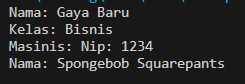

## Percobaan 4
<br>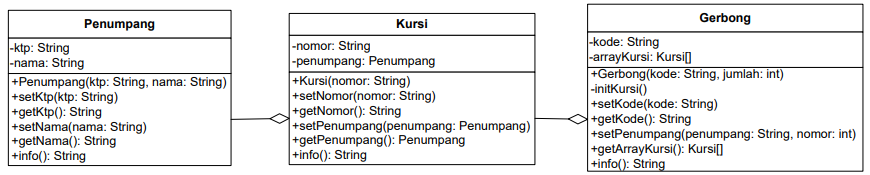

<ol type="a">
<li>Buatlah masing‑masing class Penumpang, Kursi dan Gerbong sesuai rancangan 
tersebut
<br><b>Class Penumpang</b>

```java
package Pertemuan4.Percobaan4;

public class Penumpang {
    private String ktp, nama;

    public Penumpang(String ktp, String nama) {
        this.ktp = ktp;
        this.nama = nama;
    }

    public void setKtp(String ktp) {
        this.ktp = ktp;
    }

    public String getKtp() {
        return ktp;
    }

    public void setNama(String nama) {
        this.nama = nama;
    }

    public String getNama() {
        return nama;
    }

    public String info() {
        String info = "";
        info += "Ktp: " + ktp + "\n";
        info += "Nama: " + nama + "\n";
        return info;
    }

}
```

<br><b>Class Kursi</b>

```java
package Pertemuan4.Percobaan4;

public class Kursi {
    private String nomor;
    private Penumpang penumpang;

    public Kursi(String nomor) {
        this.nomor = nomor;
    }

    public void setNomor(String nomor) {
        this.nomor = nomor;
    }

    public String getNomor() {
        return nomor;
    }

    public void setPenumpang(Penumpang penumpang) {
        this.penumpang = penumpang;
    }

    public Penumpang getPenumpang() {
        return penumpang;
    }

    public String info() {
        String info = "";
        info += "Nomor: " + nomor + "\n";
        if (this.penumpang != null) {
            info += "Penumpang: " + penumpang.info() + "\n";
        }
        return info;
    }
}
```


<br><b>Class Gerbong</b>

```java
package Pertemuan4.Percobaan4;

public class Gerbong {
    private String kode;
    private Kursi arrayKursi[];

    public Gerbong(String kode, int jumlah) {
        this.kode = kode;
        this.arrayKursi = new Kursi[jumlah];
        this.initKursi();
    }

    private void initKursi() {
        for (int i = 0; i < arrayKursi.length; i++) {
            this.arrayKursi[i] = new Kursi(String.valueOf(i + 1));
        }
    }

    public void setKode(String kode) {
        this.kode = kode;
    }

    public String getKode() {
        return kode;
    }

    public Kursi[] getArrayKursi() {
        return arrayKursi;
    }

    public void setPenumpang(Penumpang penumpang, int nomor) {
        this.arrayKursi[nomor - 1].setPenumpang(penumpang);
    }

    public String info() {
        String info = "";
        info += "Kode: " + kode + "\n";
        for (Kursi kursi : arrayKursi) {
            info += kursi.info();
        }
        return info;
    }

}
```
<li>Buatlah class MainPercobaan4 yang berisi method main().
<br><b>Main</b>

```java
package Pertemuan4.Percobaan4;

public class MainPercobaan {
    public static void main(String[] args) {
        Penumpang p = new Penumpang("12345", "Mr. Krab");
        Gerbong gerbong = new Gerbong("A", 10);
        gerbong.setPenumpang(p, 1);
        System.out.println(gerbong.info());
    }
}
```

<br><b>Hasil</b>
<br>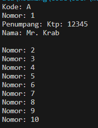
</ol>


## Pertanyaan
1. Pada main program dalam class MainPercobaan4, berapakah jumlah kursi dalam Gerbong A ?
<br> jumlah kursi pada gerbong A adalah 10 kursi
2. Perhatikan potongan kode pada method info() dalam class Kursi. Apa maksud kode tersebut ?
<br>...
<br>if (this.penumpang != null) {
<br>info += "Penumpang: " + penumpang.info() + "\n";}
<br>...
<br>Maksud dari kode diatas adalah ketika nilai dari objek penumpang tidak null/kosong maka info akan ditambahkan dengan "Penumpang: " + penumpang.info();

3. Mengapa pada method setPenumpang() dalam class Gerbong, nilai nomor dikurangi dengan angka 1 ?
<br>Karena array berawal dari index 0 sehingga jika tidak dikurangi nantinya pada kursi terakhir akan terjadi error

4. Instansiasi objek baru budi dengan tipe Penumpang, kemudian masukkan objek baru tersebut pada gerbong dengan gerbong.setPenumpang(budi, 1). Apakah yang terjadi?

```java
package Pertemuan4.Percobaan4;

public class MainPercobaan {
    public static void main(String[] args) {
        Penumpang p = new Penumpang("12345", "Mr. Krab");
        Penumpang budi = new Penumpang("00001", "Budiono");

        Gerbong gerbong = new Gerbong("A", 10);

        gerbong.setPenumpang(p, 1);
        gerbong.setPenumpang(budi, 1);
        
        System.out.println(gerbong.info());
    }
}

```
<br><b>Hasil : </b>
<br>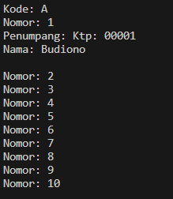

5. Modifikasi program sehingga tidak diperkenankan untuk menduduki kursi yang sudah ada penumpang lain !
<br>Yang dimodifikasi pada <b>class Gerbong</b> :

```java
public void setPenumpang(Penumpang penumpang, int nomor) {
        if (this.arrayKursi[nomor - 1].getPenumpang()==null) {
            this.arrayKursi[nomor - 1].setPenumpang(penumpang);
        }else{
            setPenumpang(penumpang, nomor+1);;
        }
    }
```

<br><b>Class Main :</b>

```java
package Pertemuan4.Percobaan4;

public class MainPercobaan {
    public static void main(String[] args) {
        Penumpang p = new Penumpang("12345", "Mr. Krab");
        Penumpang budi = new Penumpang("00001", "Budiono");
        Penumpang jack = new Penumpang("00002", "Jackie");

        Gerbong gerbong = new Gerbong("A", 10);

        gerbong.setPenumpang(p, 1);
        gerbong.setPenumpang(budi, 1);
        gerbong.setPenumpang(jack, 1);
        
        System.out.println(gerbong.info());
    }
}
```

<br><b>Hasil</b> 
<br>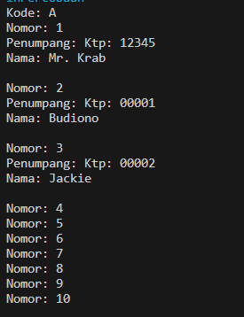

## Tugas

Berdasarkan latihan di pertemuan teori, rancang dengan class diagram, kemudian implementasikan ke dalam program! Studi kasus harus mewakili relasi class dari percobaan‑percobaan yang telah dilakukan pada materi ini, setidaknya melibatkan minimal 4 class (class yang berisi main tidak dihitung)
<br>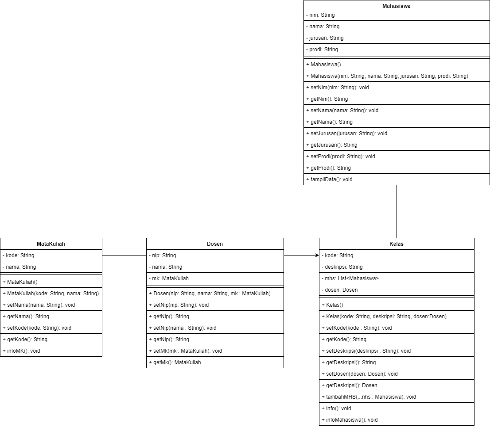

<br><b>Class Mahasiswa</b>

```java
package Pertemuan4.Tugas;

import java.util.ArrayList;
import java.util.List;

public class Mahasiswa {
    private String nim, nama, jurusan, prodi;
    private List <MataKuliah> mk;
    public Mahasiswa() {

    }

    public Mahasiswa(String nim, String nama, String jurusan,String prodi){
        this.nim=nim;
        this.nama=nama;
        this.jurusan=jurusan;
        this.prodi=prodi;
        this.mk = new ArrayList<>();
    }

    public void setNim(String nim) {
        this.nim = nim;
    }

    public String getNim() {
        return nim;
    }

    public void setNama(String nama) {
        this.nama = nama;
    }

    public String getNama() {
        return nama;
    }

    public void setJurusan(String jurusan) {
        this.jurusan = jurusan;
    }

    public String getJurusan() {
        return jurusan;
    }

    public void setProdi(String prodi) {
        this.prodi = prodi;
    }

    public String getProdi() {
        return prodi;
    }

    public void tambahMK(MataKuliah ...mk){
        for (int i = 0; i < mk.length; i++) {
            this.mk.add(mk[i]);
            
        }
    }

    public void tampilData(){
        System.out.println("Nama : "+nama);
        System.out.println("NIM : "+nim);
        System.out.println("Jurusan : "+jurusan);
        System.out.println("Prodi : "+prodi);
        mkDiambil();
    }

    public void mkDiambil(){
        System.out.println("Mata Kuliah yang Diambil : ");
        for (int i = 0; i < mk.size(); i++) {
            System.out.println(i+1 +". "+mk.get(i).getNama());
        }
    }
}
```

<br><b>Class Dosen</b>

```java
package Pertemuan4.Tugas;

public class Dosen {
    private String nip, nama;
    private MataKuliah mk;
    public Dosen() {

    }

    public Dosen(String nip, String nama, MataKuliah mk){
        this.nip=nip;
        this.nama=nama;
        this.mk=mk;
    }

    public void setNip(String nip) {
        this.nip = nip;
    }

    public String getNip() {
        return nip;
    }

    public void setNama(String nama) {
        this.nama = nama;
    }

    public String getNama() {
        return nama;
    }
    public void setMk(MataKuliah mk) {
        this.mk = mk;
    }
    public MataKuliah getMk() {
        return mk;
    }
}
```

<br><b>Class MataKuliah</b>

```java
package Pertemuan4.Tugas;

public class MataKuliah {
    private String kode, nama;

    public MataKuliah() {

    }
    public MataKuliah(String kode, String nama){
        this.kode=kode;
        this.nama=nama;
    }

    public void setNama(String nama) {
        this.nama = nama;
    }

    public String getNama() {
        return nama;
    }

    public void setKode(String kode) {
        this.kode = kode;
    }

    public String getKode() {
        return kode;
    }
    public void infoMK(){
        System.out.println("Kode : "+kode);
        System.out.println("Nama : "+nama);
    }
}
```

<br><b>Class Kelas</b>

```java
package Pertemuan4.Tugas;

import java.util.ArrayList;
import java.util.List;

public class Kelas {
    private String kode, deskripsi;
    private List <Mahasiswa> mhs;
    private Dosen dosen;

    public Kelas() {

    }

    public Kelas(String kode, String deskripsi, Dosen dosen) {
        this.kode = kode;
        this.deskripsi = deskripsi;
        this.dosen = dosen;
        this.mhs = new ArrayList<>();
    }

    public void setKode(String kode) {
        this.kode = kode;
    }

    public String getKode() {
        return kode;
    }

    public void setDeskripsi(String deskripsi) {
        this.deskripsi = deskripsi;
    }

    public String getDeskripsi() {
        return deskripsi;
    }

    public void setDosen(Dosen dosen) {
        this.dosen = dosen;
    }

    public Dosen getDosen() {
        return dosen;
    }

    public void tambahMHS(Mahasiswa ...mhs){
        for (int i = 0; i < mhs.length; i++) {
            this.mhs.add(mhs[i]);
        }
    }

    public void info(){
        System.out.println("Kelas : " + kode +" - "+ deskripsi);
        System.out.println("Dosen : "+this.dosen.getNama());
        System.out.println("Mata Kuliah : "+this.dosen.getMk().getNama());
        infoMahasiswa();
    }

    public void infoMahasiswa(){
        System.out.println("Daftar Mahasiswa di Kelas ini : ");
        for (int i = 0; i < mhs.size(); i++) {
            System.out.println((i+1)+". "+mhs.get(i).getNama());
        }
    }
}
```

<br><b>Main</b>

```java
package Pertemuan4.Tugas;

public class TugasMain {
    public static void main(String[] args) {
        MataKuliah mk1 = new MataKuliah("BDL","Basis Data Lanjur" );
        MataKuliah mk2 = new MataKuliah("PBO", "Pemrograman Berbasis Objek");
        MataKuliah mk3 = new MataKuliah("DPW", "Desain dan Pemrograman Web");

        Mahasiswa mhs1 = new Mahasiswa("2241720146","Agzy", "Teknologi Informasi", "Teknik Informatika");
        Mahasiswa mhs2 = new Mahasiswa("2241720111","Achmad", "Teknologi Informasi", "Teknik Informatika");
        Mahasiswa mhs3 = new Mahasiswa("2241720099","Reza", "Teknologi Informasi", "Teknik Informatika");
        Mahasiswa mhs4 = new Mahasiswa("2241720024","Mira", "Teknologi Informasi", "Teknik Informatika");
        Mahasiswa mhs5 = new Mahasiswa("2241720105","Alice", "Teknologi Informasi", "Teknik Informatika");

        mhs1.tambahMK(mk1,mk2,mk3);
        mhs2.tambahMK(mk1,mk2,mk3);
        mhs3.tambahMK(mk1,mk2,mk3);
        mhs4.tambahMK(mk1,mk2,mk3);
        mhs5.tambahMK(mk1,mk2,mk3);
        
        // mhs1.tampilData();

        Dosen dsn1 = new Dosen("0900123","Mbappesi", mk2);

        Kelas kls1 = new Kelas("LPR01","Lab Pemrograman 1", dsn1);
        kls1.tambahMHS(mhs1,mhs2,mhs3,mhs4,mhs5);
        kls1.info();
    }
}

```


<br><b>Hasil</b>
<br>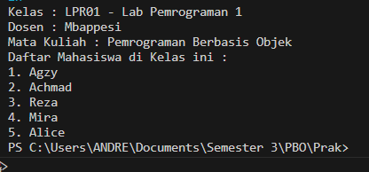