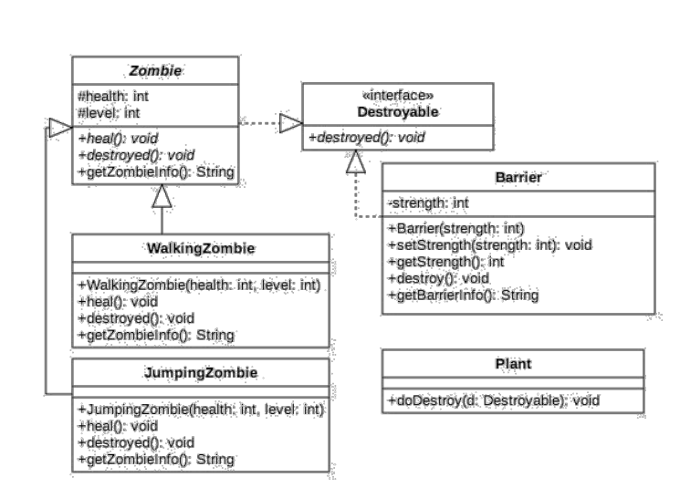

## Jobsheet 12 - Polimorfisme

### Nama : Andreagazy Iza Amerianto

### NIM : 2241720146

### Kelas : TI-2C

## Studi Kasus

<br>

## Percobaan 1 – Bentuk dasar polimorfisme

### Langkah Percobaan

1. Buat class Employee

```java
package Pertemuan12.Praktikum;

public class Employee {
    protected String name;

    public String getEmployeeInfo(){
        return "Name = "+name;
    }
    
}

```

2. Buat interface Payable

```java
package Pertemuan12.Praktikum;

public interface Payable {
    public int getPaymentAmount();
}

```

3. Buat class InternshipEmployee, subclass dari Employee

```java
package Pertemuan12.Praktikum;

public class InternshipEmployee extends Employee {
    private int length;

    public InternshipEmployee(String name, int length){
        this.length=length;
        this.name=name;
    }
    public int getLength() {
        return length;
    }
    public void setLength(int length) {
        this.length = length;
    }
    @Override
    public String getEmployeeInfo() {
        String info = super.getEmployeeInfo()+"\n";
        info += "Registered as internship employee for "+length+" month/s\n";
        return info;
    }
}

```

4. Buat class PermanentEmployee, subclass dari Employee dan implements ke Payable

```java
package Pertemuan12.Praktikum;

public class PermanentEmployee extends Employee implements Payable {
    private int salary;

    public PermanentEmployee(String name, int salary) {
        this.name = name;
        this.salary = salary;
    }

    public int getSalary() {
        return salary;
    }

    public void setSalary(int salary) {
        this.salary = salary;
    }

    @Override
    public int getPaymentAmount() {
        return (int) (salary + 0.05 * salary);
    }

    @Override
    public String getEmployeeInfo() {
        String info = super.getEmployeeInfo() + "\n";
        info += "Registered as permanent employee with salary " + salary + " month/s\n";
        return info;
    }

}

```

5. Buat class ElectricityBill yang implements ke interface Payable

```java
package Pertemuan12.Praktikum;

public class ElectricityBill implements Payable {
    private int kwh;
    private String category;

    public ElectricityBill(int kwh, String category) {
        this.kwh = kwh;
        this.category = category;
    }

    public int getKwh() {
        return kwh;
    }

    public void setKwh(int kwh) {
        this.kwh = kwh;
    }

    public String getCategory() {
        return category;
    }

    public void setCategory(String category) {
        this.category = category;
    }

    @Override
    public int getPaymentAmount() {
        return kwh * getBasePrice();
    }

    public int getBasePrice() {
        int bPrice = 0;
        switch (category) {
            case "R-1":
                bPrice = 100;
                break;
            case "R-2":
                bPrice = 200;
                break;
            default:
                break;
        }
        return bPrice;
    }
    public String getBillInfo(){
        return "kWH = "+kwh+"\n"+"Category = "+category+"("+getBasePrice()+" per kWH)\n";
    }

}

```

6. Buat class Tester1


```java
package Pertemuan12.Praktikum;

public class Tester1 {
    public static void main(String[] args) {
        PermanentEmployee pEmp = new PermanentEmployee("Dedik", 500);
        InternshipEmployee iEmp = new InternshipEmployee("Sunarto", 5);
        ElectricityBill eBill = new ElectricityBill(5, "A-1");
        Employee e;
        Payable p;

        e = pEmp;
        e = iEmp;
        p = pEmp;
        p = eBill;
    }
}
```

### Pertanyaan

1. Class apa sajakah yang merupakan turunan dari class Employee?
   <br>Turunan dari class Employee adalah class InternshipEmployee dan PermanentEmployee
2. Class apa sajakah yang implements ke interface Payable?
   <br>yang implements ke interface Payable adalah class PermanentEmployee dan ElectricityBill
3. Perhatikan class Tester1, baris ke-10 dan 11. Mengapa e, bisa diisi dengan objek pEmp (merupakan objek dari class PermanentEmployee) dan objek iEmp (merupakan objek dari class InternshipEmploye) ?
   <br>Karena pEmp dan iEmp merupakan objek yang berasal dari turunan Class Employee sehingga objek e dari class Employee dapat diisi dengan pEmp dan iEmp
4. Perhatikan class Tester1, baris ke-12 dan 13. Mengapa p, bisa diisi dengan objek pEmp (merupakan objek dari class PermanentEmployee) dan objek eBill (merupakan objek dari class ElectricityBill) ?
   <br>Karena objek pEmp dan eBill merupakan implements dari interface Payable yang dimana p adalah objeknya sehingga p dapat diisi dengan pEmp dan eBill
5. Coba tambahkan sintaks:
   p = iEmp;
   e = eBill;
   pada baris 14 dan 15 (baris terakhir dalam method main) ! Apa yang menyebabkan error?
   <br>Terjadi error pada keduanya karena iEmp bukan merupakan implements dari p dan eBill juga bukan merupakan turunan dari objek e;
6. Ambil kesimpulan tentang konsep/bentuk dasar polimorfisme
   <br>Polimorfisme merupakan konsep yang dimana suatu Class dapat memiliki banyak bentuk lain dan method. Seperti diatas Class Employee sebagai SuperClass memiliki SubClass yaitu InternshipEmployee dan PermanentEmployee. Begitu juga yang terjadi pada interface Payable yang dimana ElectricityBill dan PermanentEmploye implements dengan Payable.

## Percobaan 2 – Virtual method invocation

### Langkah Percobaan

1. Pada percobaan ini masih akan digunakan class-class dan interface yang digunakan pada percobaan sebelumnya.
2. Buat class baru dengan nama Tester2.

```java
package Pertemuan12.Praktikum;

public class Tester2 {
    public static void main(String[] args) {
        PermanentEmployee pEmp = new PermanentEmployee("Dedik", 500);
        Employee e;
        e = pEmp;
        System.out.println(""+e.getEmployeeInfo());
        System.out.println("------------------");
        System.out.println(""+pEmp.getEmployeeInfo());
    }
}
```

3. Jalankan class Tester2, dan akan didapatkan hasil sebagai berikut

### Pertanyaan

1. Perhatikan class Tester2 di atas, mengapa pemanggilan e.getEmployeeInfo() pada baris 8 dan pEmp.getEmployeeInfo() pada baris 10 menghasilkan hasil sama?
   <br>Karena dilakukan e = pEmp sehingga nilai dari objek e sama dengan pEmp oleh karena itu pemanggilan baris 8 dan 10 menghasilkan nilai yang sama
2. Mengapa pemanggilan method e.getEmployeeInfo() disebut sebagai pemanggilan method virtual (virtual method invication), sedangkan pEmp.getEmployeeInfo() tidak?
   <br>Karena pada e.getEmployeeInfo() yang dipanggil adalah method getEmployeeInfo() yang terdapat pada Class PermanentEmployee.

3. Jadi apakah yang dimaksud dari virtual method invocation? Mengapa disebut virtual?
   Karena pada saat dilakukan pemanggilan yang dipanggil adalah method dari class lain yang merupakan Subclass dari class tersebut.

## Percobaan 3 – Heterogenous Collection

### Langkah Percobaan

1. Pada percobaan ke-3 ini, masih akan digunakan class-class dan interface pada percobaan sebelumnya.
2. Buat class baru Tester3

```java
package Pertemuan12.Praktikum;

public class Tester3 {
    public static void main(String[] args) {
        
        PermanentEmployee pEmp = new PermanentEmployee("Dedik",500);
        InternshipEmployee iEmp = new InternshipEmployee("Sunarto", 5);
        ElectricityBill eBill = new ElectricityBill(5, "A-1");
        Employee e[] = {pEmp,iEmp};
        Payable p[] = {pEmp, eBill};
        Employee e2[]={pEmp,iEmp,eBill};
    }
}

```


### Pertanyaan

1. Perhatikan array e pada baris ke-8, mengapa ia bisa diisi dengan objek-objek dengan tipe yang berbeda, yaitu objek pEmp (objek dari PermanentEmployee) dan objek iEmp (objek dari InternshipEmployee) ?
   <br>Karena array e adalah Class Employee yang merupakan SuperClass dari class PermanentEmployee dan InternshipEmployee sehingga e dapat diisi objek dari kedua class tersebut
2. Perhatikan juga baris ke-9, mengapa array p juga biisi dengan objek-objek dengan tipe yang berbeda, yaitu objek pEmp (objek dari PermanentEmployee) dan objek eBill (objek dari ElectricityBilling) ?
   <br>Karena array p adalah Interface Employee yang yang dimana class PermanentEmployee dan InternshipEmployee merupakan impementasi dari class tersebut sehingga array p dapat diisi objek dari kedua class tersebut
3. Perhatikan baris ke-10, mengapa terjadi error?
   <br>Terjadi error karena eBill yang merupakan objek dari class ElectricityBill tidak memiliki relasi dengan class Employee sehingga array e2 diisi dengan eBill

## Percobaan 4 – Argumen polimorfisme, instanceof dan casting objek

### Langkah Percobaan

1. Percobaan 4 ini juga masih menggunakan class-class dan interface yang digunakan pada percobaan sebelumnya.
2. Buat class baru dengan nama Owner. Owner bisa melakukan pembayaran baik kepada pegawai permanen maupun rekening listrik melalui method pay(). Selain itu juga bisa menampilkan info pegawai permanen maupun pegawai magang melalui method showMyEmployee().

```java
package Pertemuan12.Praktikum;

public class Owner {
    public void pay(Payable p){
        System.out.println("Total payment = "+p.getPaymentAmount());
        if (p instanceof ElectricityBill) {
            ElectricityBill eb = (ElectricityBill)p;
            System.out.println(""+eb.getBillInfo());
        }else if (p instanceof PermanentEmployee) {
            PermanentEmployee pe=(PermanentEmployee)p;
            pe.getEmployeeInfo();
            System.out.println(""+pe.getEmployeeInfo());
        }
    }

    public void showMyEmployee(Employee e){
        System.out.println(""+e.getEmployeeInfo());
        if (e instanceof PermanentEmployee) {
            System.out.println("You have to pay her/him monthly!!!");
        }else{
            System.out.println("No need to pay him/her :)");
        }
    }
}

```

3. Buat class baru Tester4

```java
package Pertemuan12.Praktikum;

public class Tester4 {
    public static void main(String[] args) {
        Owner ow = new Owner();
        ElectricityBill eBill = new ElectricityBill(5,"R-1");
        ow.pay(eBill);
        System.out.println("-----------------------------------------------");

        PermanentEmployee pEmp = new PermanentEmployee("Dedik",500);
        ow.pay(pEmp);
        System.out.println("-----------------------------------------------");
        
        InternshipEmployee iEmp = new InternshipEmployee("Sunarto",5);
        ow.showMyEmployee(pEmp);
        System.out.println("-----------------------------------------------");
        ow.showMyEmployee(iEmp);
    }
}
```


### Pertanyaan

1. Perhatikan class Tester4 baris ke-7 dan baris ke-11, mengapa pemanggilan ow.pay(eBill) dan ow.pay(pEmp) bisa dilakukan, padahal jika diperhatikan method pay() yang ada di dalam class Owner memiliki argument/parameter bertipe Payable?J ika diperhatikan lebih detil eBill merupakan objek dari ElectricityBill dan pEmp merupakan objek dari PermanentEmployee?
   <br>Karena eBill merupakan objek dari ElectricityBill dan pEmp merupakan objek dari PermanentEmployee adalah implements dari class Payable sehingga kedua objek tersebut dapat dilakukan pemanggilan disaat parameter bertipe Payable
2. Jadi apakah tujuan membuat argument bertipe Payable pada method pay() yang ada di dalam class Owner?
   <br>Agar dapat memanggil seluruh objek yang merupakan implements dari interface Payable.
3. Coba pada baris terakhir method main() yang ada di dalam class Tester4 ditambahkan perintah ow.pay(iEmp);
   Mengapa terjadi error?
   <br>Terjadi error karena iEmp yang merupakan objek dari class InternshipEmployee bukan implements dari interface Payable sehingga tidak dapal dipanggil
4. Perhatikan class Owner, diperlukan untuk apakah sintaks p instanceof ElectricityBill pada baris ke-6 ?
   <br>p instanceof ElectricityBill diperlukan untuk mengetahui apakah p merupakan objek dari class ElectricityBill, jika iya akan mengembalikan nilai true dan jika tidak akan mengembalikan nilai false
5. Perhatikan kembali class Owner baris ke-7, untuk apakah casting objek disana (ElectricityBill eb = (ElectricityBill) p) diperlukan ? Mengapa objek p yang bertipe Payable harus di-casting ke dalam objek eb yang bertipe ElectricityBill
   <br>Casting objek (ElectricityBill eb = (ElectricityBill) p) diperlukan karena p awalnya adalah interface Payable sehingga adanya casting memberi tahu compiler bahwa objek p yang dimasukkan adalah objek yang bertipe ElectricityBill

## Tugas

Dalam suatu permainan, Zombie dan Barrier bisa dihancurkan oleh Plant dan bisa menyembuhkan diri. Terdapat dua jenis Zombie, yaitu Walking Zombie dan Jumping Zombie. Kedua Zombie tersebut memiliki cara penyembuhan yang berbeda, demikian juga cara penghancurannya, yaitu ditentukan oleh aturan
berikut ini:

Pada WalkingZombie
<br>Penyembuhan : Penyembuhan ditentukan berdasar level zombie yang bersangkutan
<br>Jika zombie level 1, maka setiap kali penyembuhan, health akan bertambah 20%
<br>Jika zombie level 2, maka setiap kali penyembuhan, health akan bertambah 30%
<br>Jika zombie level 3, maka setiap kali penyembuhan, health akan bertambah 40%
<br>Penghancuran : setiap kali penghancuran, health akan berkurang 2%
<br>
<br>Pada Jumping Zombie
<br>Penyembuhan : Penyembuhan ditentukan berdasar level zombie yang bersangkutan
<br>Jika zombie level 1, maka setiap kali penyembuhan, health akan bertambah 30%
<br>Jika zombie level 2, maka setiap kali penyembuhan, health akan bertambah 40%
<br>Jika zombie level 3, maka setiap kali penyembuhan, health akan bertambah 50%
<br>Penghancuran : setiap kali penghancuran, health akan berkurang 1%
    
Buat program dari class diagram di bawah ini :
<br>

<br><b>Interface Destroyable</b>

```java
package Pertemuan12.Tugas;

public interface Destroyable {
    public void destroyed();
}

```

<br><b>Class Zombie</b>

```java
package Pertemuan12.Tugas;

public class Zombie implements Destroyable  {
    protected int health, level;

    public void heal(){
        health +=100;
    }

    @Override
    public void destroyed() {
        health-=100;
    }

    public String getZombieInfo(){
        return "Health = "+this.health+"\nLevel = "+this.level+"\n";
    }
}

```

<br><b>Class WalkingZombie</b>

```java
package Pertemuan12.Tugas;

public class WalkingZombie extends Zombie {
    public WalkingZombie(int health, int level) {
        this.health = health;
        this.level = level;
    }

    @Override
    public void heal() {
        if (level == 1) {
            health += health * 10 / 100;
        } else if (level == 2) {
            health += health * 30 / 100;
        } else if (level == 3) {
            health += health * 40 / 100;
        }else{
            super.heal();
        }
    }

    @Override
    public void destroyed() {
        if (health<=0) {
            System.out.println("Zombie Telah Dihancurkan");
        }else{
            health -= health*20/100;
        }
    }

    @Override
    public String getZombieInfo() {
    
        return "Walking Zombie Data =\n"+super.getZombieInfo();
    }
}

```

<br><b>Class JumpingZombie</b>

```java
package Pertemuan12.Tugas;

public class JumpingZombie extends Zombie{
    public JumpingZombie(int health, int level) {
        this.health = health;
        this.level = level;
    }

    @Override
    public void heal() {
        if (level == 1) {
            health += health * 30 / 100;
        } else if (level == 2) {
            health += health * 40 / 100;
        } else if (level == 3) {
            health += health * 50 / 100;
        }else{
            super.heal();
        }
    }

    @Override
    public void destroyed() {
        if (health<=0) {
            System.out.println("Zombie Telah Dihancurkan");
        }else{
            health -= health*10/100;
        }
    }

    @Override
    public String getZombieInfo() {
    
        return "Jumping Zombie Data =\n"+super.getZombieInfo();
    }
}

```

<br><b>Class Barrier</b>

```java
package Pertemuan12.Tugas;

public class Barrier implements Destroyable{
    private int strength;

    public Barrier(int strength){
        this.strength=strength;
    }

    public void setStrength(int strength) {
        this.strength = strength;
    }

    public int getStrength() {
        return strength;
    }

    @Override
    public void destroyed() {
    if (strength<=0) {
        System.out.println("Barrier Telah Dihancurkan");
    }else{
        strength-=9;
    }
    }

    public String getBarrierInfo(){
        return "Barrier Strength = "+strength+"\n";
    }
    
}
```

<br><b>Class Plant</b>

```java
package Pertemuan12.Tugas;

public class Plant {
    public void doDestroy(Destroyable d){
        if (d instanceof WalkingZombie) {
            WalkingZombie wz = (WalkingZombie)d;
            wz.destroyed();
        }else if (d instanceof JumpingZombie) {
            JumpingZombie jz = (JumpingZombie)d;
            jz.destroyed();
        }else if (d instanceof Barrier) {
            Barrier br = (Barrier)d;
            br.destroyed();
        }
    }
}

```

<br>
