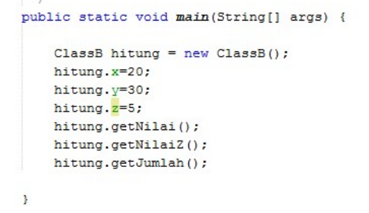
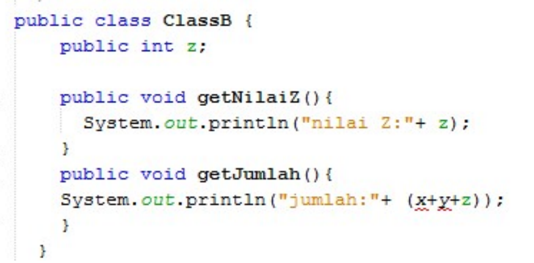

## Jobsheet 6

### Nama : Andreagazy Iza Amerianto

### NIM : 2241720146

### Kelas : TI-2C

### Percobaan 1 (Extends)
1. Buatlah sebuah class parent/superclass dengan nama ClassA.java
<br>
2. Buatlah sebuah class anak/subclass dengan nama ClassB.java
<br>
3. Buatlah class Percobaan1.java untuk menjalankan program diatas!
<br>
4. Jalankan program diatas, kemudian amati apa yang terjadi!
<br>Terjadi Error

### Pertanyaan 
1. Pada percobaan 1 diatas program yang dijalankan terjadi error, kemudian perbaiki sehingga program tersebut bisa dijalankan dan tidak error!
<br>Agar tidak terjadi error perlu ditambahkan extends pada ClassB.
<br>

```java
public class ClassB extends ClassA{
    public int z;
    public void getNilaiZ(){
        System.out.println("Nilai z : " +z);
    }
    
    public void getJumlah(){
        System.out.println("Jumlah : " + (x+y+z));
    }
}
```
2. Jelaskan apa penyebab program pada percobaan 1 ketika dijalankan terdapat error!
<br> Penyebab error dari program tersebut adalah atribut x dan y yang tidak bisa diakses pada ClassB sehingga diperlukan "extend ClassA" aga rapat mengakses atribut x dan y dari ClassA

### Percobaan 2 (Hak Akses)
1. Buatlah sebuah class parent/superclass dengan nama ClassA.java
<br>
2. Buatlah sebuah class anak/subclass dengan nama ClassB.java
<br>
3. Buatlah class Percobaan2.java untuk menjalankan program diatas
<br>
4. Jalankan program diatas, kemudian amati apa yang terjadi

### Pertanyaab
1. Pada percobaan 2 diatas program yang dijalankan terjadi error, kemudian perbaiki sehingga program tersebut bisa dijalankan dan tidak error.
<br><b>ClassA</b>

```java
public class ClassA {
    private int x;
    private int y;

    public void setX(int x) {
        this.x = x;
    }
    public int getX() {
        return x;
    }

    public void setY(int y) {
        this.y = y;
    }
    public int getY() {
        return y;
    }

    public void getNilai(){
        System.out.println("nilai x : "+x);
        System.out.println("nilai y : "+y);
    }
}

```

<br><b>ClassB</b>

```java
public class ClassB extends ClassA{
    private int z;
    
    public void setZ(int z) {
        this.z = z;
    }

    public void getNilaiZ(){
        System.out.println("Nilai z : " +z);
    }
    
    public void getJumlah(){
        System.out.println("Jumlah : " + (getX()+getY()+z));
    }
}

```
2. Jelaskan apa penyebab program pada percobaan 2 ketika dijalankan terdapat error! 
<br>Penyebab terjadnya error pada percobaan 2 diatas karena atribut x dan atribut y memiliki modifier private sehingga x dan y hanya dapat diakses pada class tersebut saja sehingga diperlukan Getter untuk mengambil nilai dari atribut x dan y. Selain itu diperlukan extends ClassA pada ClassB sehingga atribut x dan y dapat deilakukan getter pada ClassB.


### Percobaan 3 (Super)
1. Buatlah sebuah class parent/superclass dengan nama Bangun.java
<br>
2. Buatlah sebuah class anak/subclass dengan nama Tabung.java
<br>
3. Buatlah class Percobaan3.java untuk menjalankan program diatas!
<br>
4. Jalankan program diatas!

### Pertanyaan
1. Jelaskan fungsi “super” pada potongan program berikut di class Tabung!
<br>
<br>Pada potongan program tersebut "super" merujuk pada atribut "phi" dan "r" pada class parent (Bangun).

2. Jelaskan fungsi “super” dan “this” pada potongan program berikut di class Tabung!
<br>
<br>fungsi "super" pada potongan program tersebut adalah mengambil nilai atribut "phi" dan "r" pada class parent(Bangun) sehingga dapat dikalikan pada method tersebut. Sedangkan "this" mengambil nilai dari atribut "t" pada class itu sendiri(Tabung).

3. Jelaskan mengapa pada class Tabung tidak dideklarasikan atribut “phi” dan “r” tetapi class tersebut dapat mengakses atribut tersebut!
<br>Karena pada Class Tabung terdapat "extends Bangun" yang menandakan class Tabung merupakan turunan dari class Bangun sehingga Tabung dapat mengakses atribut "phi" dan "r"

### Percobaan 4 (Super Konstruktor)
1. Buatlah tiga file dengan nama ClassA.java , ClassB.java , dan ClassC.java, seperti pada kode program dibawah ini!
<br><b>ClassA.java</b>
<br>
<br><b>ClassB.java</b>
<br>
<br><b>ClassC.java</b>
<br>

2. Buatlah class Percobaan4.java untuk menjalankan program diatas!
<br>

3. Jalankan program kemudian amati apa yang terjadi!

### Pertanyaan
1. Pada percobaan 4 sebutkan mana class yang termasuk superclass dan subclass, kemudian 
jelaskan alasannya!
<br>Class yang termasuk superclass adalah ClassA dan ClassB karena kedua class tersebut memiliki subclass, dan yang merupakan subclass adalah ClassB dan ClassC karena kedua class tersebut miliki superclass/parent class.

2. Ubahlah isi konstruktor default ClassC seperti berikut:
<br>
Tambahkan kata super() di baris Pertaman dalam konstruktor defaultnya. Coba jalankan kembali class Percobaan4 dan terlihat tidak ada perbedaan dari hasil outputnya!

```java
public class ClassC extends ClassB{
    ClassC(){
        super();
        System.out.println("Konstruktor C dijalankan");
    }
}
```
<br>

3. Ubahlah isi konstruktor default ClassC seperti berikut:
<br>
Ketika mengubah posisi super() dibaris kedua dalam kontruktor defaultnya dan terlihat ada error. Kemudian kembalikan super() kebaris pertama seperti sebelumnya, maka errornya akan hilang.
Perhatikan hasil keluaran ketika class Percobaan4 dijalankan. Kenapa bisa tampil output seperti berikut pada saat instansiasi objek test dari class ClassC
<br>
Jelaskan bagaimana urutan proses jalannya konstruktor saat objek test dibuat!
<br>Pada Konstruktor ClassC dipanggil pertama kali karena membuat objek test, kemudian dalam ClassC dilakukan "super();" yang memanggil konstruktor superclass yaitu ClassB. Kemudian ClassB juka memanggil kosntruktor ClassA. sehingga dihasilkan seperti diatas

4. Apakah fungsi super() pada potongan program dibawah ini di ClassC
<br>
<br>Fungsi dari "super()" pada potongan program tersebut adalah memanggil konstruktor dari superclassnya yaitu "ClassB"  

### Tugas
Buatlah sebuah program dengan konsep pewarisan seperti pada class diagram berikut ini. 
Kemudian buatlah instansiasi objek untuk menampilkan data nama pegawai dan gaji yang didapatkannya.
<br>

<br><b>Pegawai.java</b>

```java
package Pertemuan6.Tugas;

public class Pegawai {
    public String nip,nama,alamat;
    private int gaji;

    public Pegawai(String nip, String nama, String alamat){
        this.nip=nip;
        this.nama=nama;
        this.alamat=alamat;
    }
    public String getNama() {
        return nama;
    }
    public void setGaji(int gaji) {
        this.gaji = gaji;
    }
    public int getGaji() {
        return gaji;
    }
}

```

<br><b>Dosen.java</b>

```java
package Pertemuan6.Tugas;

public class Dosen extends Pegawai{

    public int jumlahSKS, TARIF_SKS = 200000;

    public Dosen(String nip, String nama, String alamat) {
        super(nip, nama, alamat);
    }

    public void setSKS(int jumlahSKS) {
        this.jumlahSKS = jumlahSKS;
    }

    public void setGaji(int gaji){
        super.setGaji(gaji);
    }
    
    public int getGaji(){
        return super.getGaji()+ (jumlahSKS*TARIF_SKS);
    }
    
    
}

```
<br><b>DaftarGaji.java</b>

```java
package Pertemuan6.Tugas;

import java.util.ArrayList;

public class DaftarGaji {
    // public Pegawai[] listPegawai;;
    public ArrayList<Pegawai> listPegawai;
    int gaji;
    public DaftarGaji(int gaji){
        this.gaji=gaji;
        listPegawai = new ArrayList<>();
    }

    public void addPegawai(Pegawai ...p){
        for (int i = 0; i < p.length; i++) {
            p[i].setGaji((this.gaji));
            listPegawai.add(p[i]);
        }
    }

    public void printSemuaGaji(){
        System.out.println("NIP\t||Nama\t\t||Alamat\t||Gaji");
        for (int i = 0; i < listPegawai.size(); i++) {
            System.out.println(listPegawai.get(i).nip + "\t||" + listPegawai.get(i).nama + "\t||" + listPegawai.get(i).alamat + "\t||"+listPegawai.get(i).getGaji() );
        }
    }

}
```
<br><b>main.java</b>

```java
package Pertemuan6.Tugas;

public class main {
    public static void main(String[] args) {
        Pegawai pegawai1 = new Pegawai("22001", "Ardiansyah", "Lamongan");
        Pegawai pegawai2 = new Pegawai("22002", "Dimetrescu", "Nganjuk");

        Dosen dosen1 = new Dosen("22003", "Valeria", "Blitar");
        Dosen dosen2 = new Dosen("22004", "Miranda", "Kediri");
        dosen1.setSKS(20);
        dosen1.getGaji();
        
        dosen2.setSKS(24);
        dosen2.getGaji();
        
        DaftarGaji gaji = new DaftarGaji(10000000);
        gaji.addPegawai(pegawai1,pegawai2,dosen1,dosen2);

        gaji.printSemuaGaji();
    }
}
```
