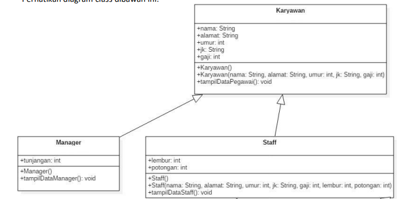
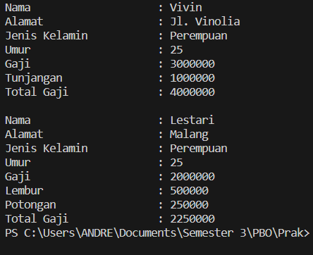
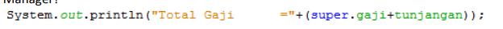
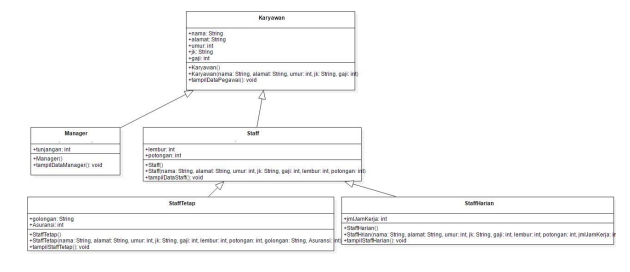
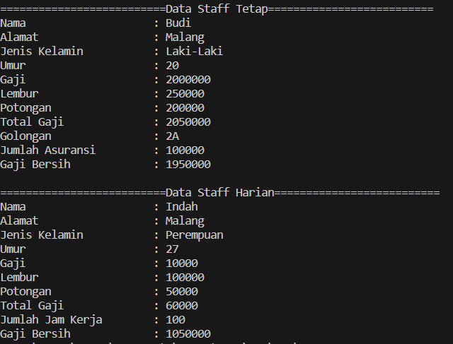
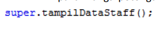
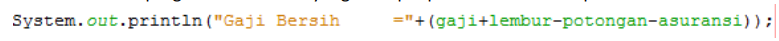
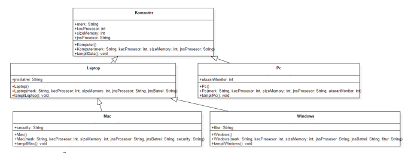
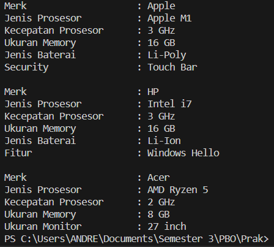

## Jobsheet 7

### Nama : Andreagazy Iza Amerianto

### NIM : 2241720146

### Kelas : TI-2C

### Percobaan 1
Perhatikan diagram class dibawah ini:
<br>

1. Buatlah class Karyawan

```java
package Pertemuan7.Praktikum1;

public class Karyawan {
    public String nama, alamat, jk;
    public int umur, gaji;
    public Karyawan(){

    }
    public Karyawan(String nama, String alamat, String jk, int umur, int gaji){
        this.nama=nama;
        this.alamat=alamat;
        this.jk=jk;
        this.umur=umur;
        this.gaji=gaji;
    }

    public void tampilDataKaryawan(){
        System.out.println("Nama\t\t\t: " + nama);
        System.out.println("Alamat\t\t\t: "+alamat);
        System.out.println("Jenis Kelamin\t\t: "+jk);
        System.out.println("Umur\t\t\t: "+umur);
        System.out.println("Gaji\t\t\t: "+gaji);
    }
    
}
```

2. Buatlah class Manager

```java
package Pertemuan7.Praktikum1;

public class Manager extends Karyawan{
    public int tunjangan;

    public Manager(){

    }

    public void tampilDataManager(){
        super.tampilDataKaryawan();
        System.out.println("Tunjangan\t\t: "+tunjangan);
        System.out.println("Total Gaji\t\t: "+(super.gaji+tunjangan));
    }
}
```

3. Buatlah class Staff

```java
package Pertemuan7.Praktikum1;

public class Staff extends Karyawan{
    public int lembur,potongan;

    public Staff(){

    }

    public Staff(String nama, String alamat, String jk, int umur, int gaji, int lembur,int potongan){
        super(nama, alamat, jk, umur, gaji);
        this.lembur=lembur;
        this.potongan=potongan;
    }

    public void tampilDataStaff(){
        super.tampilDataKaryawan();
        System.out.println("Lembur\t\t\t: "+lembur);
        System.out.println("Potongan\t\t: "+potongan);
        System.out.println("Total Gaji\t\t: "+(gaji+lembur-potongan));
    }
}

```

4. Buatlah class inheritance1

```java
package Pertemuan7.Praktikum1;

public class Inheritance1 {
    public static void main(String[] args) {
        Manager M = new Manager();
        M.nama = "Vivin";
        M.alamat= "Jl. Vinolia";
        M.umur = 25;
        M.jk = "Perempuan";
        M.gaji = 3000000;
        M.tunjangan = 1000000;
        M.tampilDataManager();
        
        System.out.println();

        Staff S = new Staff();
        S.nama = "Lestari";
        S.alamat= "Malang";
        S.umur = 25;
        S.jk = "Perempuan";
        S.gaji = 2000000;
        S.lembur = 500000;
        S.potongan = 250000;
        S.tampilDataStaff();
    }
}
```

5. Jalankan program, maka tampilanya adalah sebagai berikut
<br>


### Pertanyaan
1. Sebutkan class mana yang termasuk super class dan sub class dari percobaan 1 diatas!
<br>Pada percobaan diatas yang termasuk superclass adalah Class Karyawan sedangkan subclassnya adalah Class Staff dan Class Manager

2. Kata kunci apakah yang digunakan untuk menurunkan suatu class ke class yang lain?
<br>Kata kunci yang digunakan untuk menurunkan suatu class ke class lain adalah "extends".

3. Perhatikan kode program pada class Manager, atribut apa saja yang dimiliki oleh class tersebut? Sebutkan atribut mana saja yang diwarisi dari class Karyawan!
<br>Yang dimiliki class Manager adalah atribut tunjangan sedangkan atribut yang diwarisi dari class Karyawan adalah atribut nama, alamat, umur ,jk gaji


4. Jelaskan kata kunci super pada potongan program dibawah ini yang terdapat pada class Manager!
<br>
<br>Super pada class Manager adalah memanggil class parentnya yang dimana pada kasus tersebut mmemangil atribut gaji dari class Karyawan.


5. Program pada percobaan 1 diatas termasuk dalam jenis inheritance apa? Jelaskan alasannya!
<br>Pada percobaan 1 tersebut merupakan hierarchial inheritance karena class Karyawan memiliki lebih dari satu subclass yaitu class Manager dan Staff.


### Percobaan 2
Perhatikan digram class dibawah ini : 
<br>

1. Berdasarkan program yang sudah anda buat pada percobaan 1 sebelumnya tambahkan dua class yaitu class StaffTetap dan class StaffHarian. Kode Programnya adalah sebagai berikut
<br>Class StaffTetap.java

```java
package Pertemuan7.Praktikum2;

public class StaffTetap extends Staff{
    public String golongan;
    public int asuransi;

    public StaffTetap(){

    }

    public StaffTetap(String nama, String alamat, String jk, int umur, int gaji,int lembur,int potongan ,String golongan, int asuransi){
        super(nama, alamat, jk, umur, gaji, lembur, potongan);
        this.golongan=golongan;
        this.asuransi=asuransi;
    }

    public void tampilStaffTetap(){
        System.out.println("==========================Data Staff Tetap==========================");
        super.tampilDataStaff();
        System.out.println("Golongan\t\t: "+golongan);
        System.out.println("Jumlah Asuransi\t\t: "+asuransi);
        System.out.println("Gaji Bersih\t\t: "+(gaji+lembur-potongan-asuransi));
    }
}
```

<br>Class StaffHarian.java

```java
package Pertemuan7.Praktikum2;

public class StaffHarian extends Staff{
    public int jmlJamKerja;

    public StaffHarian(){

    }

    public StaffHarian(String nama, String alamat, String jk, int umur, int gaji,int lembur,int potongan ,int jmlJamKerja){
        super(nama, alamat, jk, umur, gaji, lembur, potongan);
        this.jmlJamKerja=jmlJamKerja;
    }

    public void tampilStaffHarian(){
        System.out.println("==========================Data Staff Harian==========================");

        super.tampilDataStaff();
        System.out.println("Jumlah Jam Kerja\t: "+jmlJamKerja);
        System.out.println("Gaji Bersih\t\t: "+(gaji*jmlJamKerja+lembur-potongan));

    }
}
```

2. Setelah membuat dua class diatas kemudian edit class inheritance1.java menjadi sebagai berikut:

```java
package Pertemuan7.Praktikum2;

public class Inheritance1 {
    public static void main(String[] args) {
        StaffTetap ST = new StaffTetap("Budi", "Malang","Laki-Laki",20, 2000000, 250000,200000, "2A", 100000);

        ST.tampilStaffTetap();

        System.out.println();

        StaffHarian SH = new StaffHarian("Indah", "Malang","Perempuan",27, 10000, 100000,50000,100);

        SH.tampilStaffHarian();
    }
}
```

3. Jalankan program maka tampilannya adalah sebagai berikut:
<br>


### Pertanyaan
1. Berdasarkan class diatas manakah yang termasuk single inheritance dan mana yang termasuk multilevel inheritance?
<br>Class diatas merupahan hybrid inheritance, yang merupakan multilevel inheritance adalah class Karyawan dan Manager, sedangkan yang multilevel adalah class Manager, class Staff dan class StaffTetap atau StaffHarian.

2. Perhatikan kode program class StaffTetap dan StaffHarian, atribut apa saja yang dimiliki oleh class tersebut? Sebutkan atribut mana saja yang diwarisi dari class Staff!
<br>pada class StaffTetap terdapat atribut gologan dan asuransi, sedangkan pada class StaffHarian terdapat atribut jmlJamKerja. Atribut yang diwarisi dari class Staff adalah lembur dan potongan.

3. Apakah fungsi potongan program berikut pada class StaffHarian
<br>
<br>Potongan program tersebut adalah memanggil konstriktor dari class parentnya yaitu class Staff.

4. Apakah fungsi potongan program berikut pada class StaffHarian
<br>
<br>Potongan program tersebut berfungsi untuk memanggil method tampilDataStaff() yang dimiliki oleh parentnya yaitu class Staff.

5. Perhatikan kode program dibawah ini yang terdapat pada class StaffTetap.
<br>
 Terlihat dipotongan program diatas atribut gaji, lembur dan potongan dapat diakses langsung. Kenapa hal ini bisa terjadi dan bagaimana class StaffTetap memiliki atribut gaji, lembur, dan potongan padahal dalam class tersebut tidak dideklarasikan atribut gaji, lembur, dan potongan?
<br>Karena ini meripakan inheritance multilevel sehingga class StaffTetap memiliki atribut parentnya yaitu class Staff dan juga memiliki atrihut dari parent dari class Staff yaitu class Karyawan. Sehingga class StaffTetap memiliki atribut tersebut

### Tugas 
1. Buatlah sebuah program dengan konsep pewarisan seperti pada class diagram berikut ini. Kemudian buatlah instansiasi objek untuk menampilkan data pada class Mac, Windows dan Pc!
<br>

<br><b>Komputer.java</b>

```java
package Pertemuan7.Tugas;

public class Komputer {
    public String merk, jnsProsesor;
    public int kecProsesor, sizeMemory;

    public Komputer(){

    }
    public Komputer(String merk, String jnsProsesor, int kecProsesor, int sizeMemory) {
        this.merk = merk;
        this.jnsProsesor = jnsProsesor;
        this.kecProsesor = kecProsesor;
        this.sizeMemory = sizeMemory;
    }
    public void tampilData() {
        System.out.println("Merk\t\t: " + merk);
        System.out.println("Jenis Prosesor\t: " + jnsProsesor);
        System.out.println("Kecepatan Prosesor\t: " + kecProsesor + " GHz");
        System.out.println("Ukuran Memory\t: " + sizeMemory + " GB");
    }
}

```

<br><b>Laptop.java</b>

```java
package Pertemuan7.Tugas;

public class Laptop extends Komputer{
    public String jnsBaterai;

    public Laptop(){

    }

    public Laptop(String merk, String jnsProsesor, int kecProsesor, int sizeMemory, String jnsBaterai) {
        super(merk, jnsProsesor, kecProsesor, sizeMemory);
        this.jnsBaterai = jnsBaterai;
    }

    public void tampilLaptop() {
        super.tampilData();
        System.out.println("Jenis Baterai: " + jnsBaterai);
    }

    
}
```

<br><b>Mac.java</b>

```java
package Pertemuan7.Tugas;

public class Mac extends Laptop{
    public String security;

    public Mac(){

    }
    public Mac(String merk, String jnsProsesor, int kecProsesor, int sizeMemory, String jnsBaterai, String security) {
        super(merk, jnsProsesor, kecProsesor, sizeMemory, jnsBaterai);
        this.security = security;
    }

    public void tampilMac() {
        super.tampilLaptop();
        System.out.println("Security: " + security);
    }
}
```

<br><b>Pc.java</b>

```java
package Pertemuan7.Tugas;

public class Pc extends Komputer{
    public int ukuranMonitor;
    public Pc(){

    }
    public Pc(String merk, String jnsProsesor, int kecProsesor, int sizeMemory, int ukuranMonitor) {
        super(merk, jnsProsesor, kecProsesor, sizeMemory);
        this.ukuranMonitor = ukuranMonitor;
    
    }
    public void tampilPc() {
        super.tampilData();
        System.out.println("Ukuran Monitor: " + ukuranMonitor + " inch");
    }
}
```

<br><b>Windows.java</b>

```java
package Pertemuan7.Tugas;

public class Windows extends Laptop{
    public String fitur;
    public Windows(){

    }
    public Windows(String merk, String jnsProsesor, int kecProsesor, int sizeMemory, String jnsBaterai, String fitur) {
        super(merk, jnsProsesor, kecProsesor, sizeMemory, jnsBaterai);
        this.fitur = fitur;
    }

    public void tampilData() {
        super.tampilLaptop();
        System.out.println("Fitur: " + fitur);
    }
}
```

<br><b>Inheritance.java</b>

```java
package Pertemuan7.Tugas;

public class Inheritance {
    public static void main(String[] args) {
        Mac mac =  new Mac("Apple", "Apple M1", 3, 16, "Li-Poly", "Touch Bar"); 

        Windows windows = new Windows("HP", "Intel i7", 3, 16, "Li-Ion", "Windows Hello");

        Pc pc = new Pc("Acer", "AMD Ryzen 5", 2, 8, 27);

        mac.tampilMac();
        System.out.println();
        windows.tampilWindows();
        System.out.println();
        pc.tampilPc();
    }
}

```

<br><b>Hasil</b>
<br>
