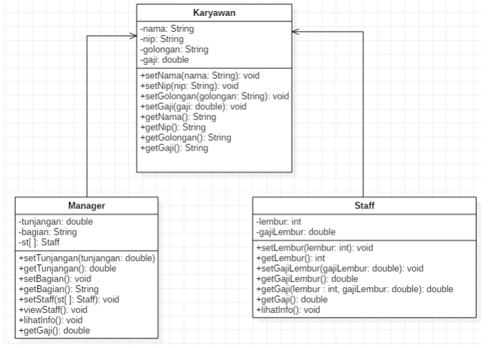
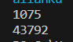
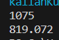
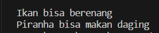
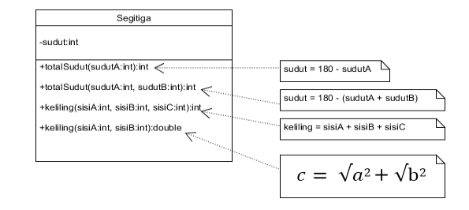
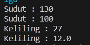
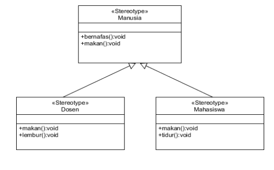
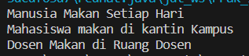

## Jobsheet 9 - Overloading dan Overriding

### Nama : Andreagazy Iza Amerianto

### NIM : 2241720146

### Kelas : TI-2C

## Praktikum

### Percobaan 1
<br>Untuk kasus contoh berikut ini, terdapat tiga kelas, yaitu Karyawan, Manager, dan Staff. Class Karyawan merupakan superclass dari Manager dan Staff dimana subclass Manager dan Staff memiliki method untuk menghitung gaji yang berbeda.
<br>

### Karyawan

```java
package Pertemuan9;

public class Karyawan {//Andreagazy
    private String nama;
    private String nip;
    private String golongan;
    private double gaji;
    
    public void setNama(String nama) {
        this.nama = nama;
    }
    public void setNip(String nip) {
        this.nip = nip;
    }
    public void setGolongan(String golongan) {
        this.golongan = golongan;
        switch (golongan.charAt(0)) {
            case '1':
                this.gaji=5000000;
                break;
            case '2':
                this.gaji=3000000;
                break;
            case '3':
                this.gaji=2000000;
                break;
            case '4':
                this.gaji=1000000;
                break;
            case '5':
                this.gaji=750000;
                break;

            default:
                break;
        }
    }

    public void setGaji(double gaji) {
        this.gaji = gaji;
    }
    
    public String getNama() {
        return nama;
    }
    public String getNip() {
        return nip;
    }
    public String getGolongan() {
        return golongan;
    }
    public double getGaji() {
        return gaji;
    }
}
```

### Staff

```java
package Pertemuan9;

public class Staff extends Karyawan {//Andreagazy
    private int lembur;
    private double gajiLembur;

    public void setLembur(int lembur) {
        this.lembur = lembur;
    }
    public int getLembur() {
        return lembur;
    }
    public void setGajiLembur(double gajiLembur) {
        this.gajiLembur = gajiLembur;
    }
    public double getGajiLembur() {
        return gajiLembur;
    }

    public double getGaji(int lembur, double gajiLembur) {
        return super.getGaji()+lembur*gajiLembur;
    }

    @Override
    public double getGaji() {
        return super.getGaji()+lembur*gajiLembur;
    }

    public void lihatInfo(){
        System.out.println("NIP : "+this.getNip());
        System.out.println("Nama : "+this.getNama());
        System.out.println("Golongan : "+this.getGolongan());
        System.out.println("Jml Lembur : "+this.getLembur());
        System.out.printf("Gaji Lembur : %.0f\n",this.getGajiLembur());
        System.out.printf("Gaji : %.0f\n ",this.getGaji());
        System.out.println();
    }
}

```

### Manager

```java
package Pertemuan9;

public class Manager  extends Karyawan{//Andreagazy
private double tunjangan;
private String bagian;
private Staff st[];
    public void setTunjangan(double tunjangan) {
        this.tunjangan = tunjangan;
    }
    public double getTunjangan() {
        return tunjangan;
    }
    public void setBagian(String bagian) {
        this.bagian = bagian;
    }
    public String getBagian() {
        return bagian;
    }
    public void setStaff(Staff[] st) {
        this.st = st;
    }
    public void viewStaff(){
        System.out.println("---------------------------------------------");
        for (int i = 0; i < st.length; i++) {
            st[i].lihatInfo();
        }
        System.out.println("---------------------------------------------");
    }

    public void lihatInfo(){
        System.out.println("Manager : "+this.getBagian());
        System.out.println("NIP : "+this.getNip());
        System.out.println("Nama : "+this.getNama());
        System.out.println("Golongan : "+this.getGolongan());
        System.out.printf("Tunjangan : %.0f\n",this.getTunjangan());
        System.out.printf("Gaji : %.0f\n",this.getGaji());
        System.out.println("Bagian : "+this.getBagian());
        this.viewStaff();
        System.out.println();
    }

    @Override
    public double getGaji() {
        return super.getGaji()+tunjangan;
    }
}
```

### Utama

```java
package Pertemuan9;

public class Utama {
    public static void main(String[] args) {//Andreagazy
        System.out.println("Program Testing Class Manager & Staff");
        Manager man[] = new Manager[2];
        Staff staff1[] = new Staff[2];
        Staff staff2[] = new Staff[3];

        man[0] = new Manager();
        man[0].setNama("Tedjo");
        man[0].setNip("101");
        man[0].setGolongan("1");
        man[0].setTunjangan(5000000);
        man[0].setBagian("Administrasi");

        man[1] = new Manager();
        man[1].setNama("Atika");
        man[1].setNip("102");
        man[1].setGolongan("1");
        man[1].setTunjangan(2500000);
        man[1].setBagian("Pemasaran");

        staff1[0] = new Staff();
        staff1[0].setNama("Usman");
        staff1[0].setNip("0003");
        staff1[0].setGolongan("2");
        staff1[0].setLembur(10);
        staff1[0].setGajiLembur(10000);

        staff1[1] = new Staff();
        staff1[1].setNama("Anugrah");
        staff1[1].setNip("0005");
        staff1[1].setGolongan("2");
        staff1[1].setLembur(10);
        staff1[1].setGajiLembur(55000);

        man[0].setStaff(staff1);

        staff2[0] = new Staff();
        staff2[0].setNama("Hendra");
        staff2[0].setNip("0004");
        staff2[0].setGolongan("3");
        staff2[0].setLembur(15);
        staff2[0].setGajiLembur(5500);

        man[1].setStaff(staff2);

        staff2[1] = new Staff();
        staff2[1].setNama("Arie");
        staff2[1].setNip("0006");
        staff2[1].setGolongan("4");
        staff2[1].setLembur(5);
        staff2[1].setGajiLembur(100000);

        staff2[2] = new Staff();
        staff2[2].setNama("Mentari");
        staff2[2].setNip("0007");
        staff2[2].setGolongan("3");
        staff2[2].setLembur(6);
        staff2[2].setGajiLembur(20000);

        man[1].setStaff(staff2);

        man[0].lihatInfo();
        man[1].lihatInfo();

    }
}
```

### Hasil 
<br>


## Latihan

```java
package Pertemuan9.Latihan;

public class PerkalianKu {//Andreagazy
    void perkalian(int a, int b){
        System.out.println(a * b);
    }
    void perkalian(int a, int b, int c){
        System.out.println(a * b * c);
    }

    public static void main(String[] args) {
        PerkalianKu objek = new PerkalianKu();
        
        objek.perkalian(25,43);
        objek.perkalian(34,23, 56);
    }
}

```

<br>


#### 4.1 Dari source coding diatas terletak dimanakah overloading?
<br>Overloading terletak pada method perkalian yang dimana nama dari method tersebut sama namun parameter yang dimiliki kedua method tersebut berbeda
yang dimana pada method pertama memiliki 2 parameter dan method kedua memiliki 3 parameter

#### 4.2 Jika terdapat overloading ada berapa jumlah parameter yang berbeda?
<br>Terdapat 1 parameter berbeda antara method 1 dan method 2 yang dimana pada method kedua terdapat int c

```java
package Pertemuan9.Latihan;

public class PerkalianKu {//Andreagazy
    
    void perkalian(int a, int b){
        System.out.println(a * b);
    }

    void perkalian(double a, double b){
                System.out.println(a * b);
    }
    


    public static void main(String[] args) {
        PerkalianKu objek = new PerkalianKu();
        
        objek.perkalian(25,43);
        objek.perkalian(34.56, 23.7);

    }
}
```

<br>


#### 4.3 Dari source coding diatas terletak dimanakah overloading?
<br>Pada source code diatas overloading terdapat pada method perkalian yang dimana terdapat 2 method yang namanya saa namun memiliki parameter yang berbeda yang terdapat pada tipe datanya.

#### 4.4 Jika terdapat overloading ada berapa tipe parameter yang berbeda?
<br>terdapat 2 tipe parameter yang berbeda yang dimana pada method perkalian yang pertama memiliki tipedata int dan pada method perkalian kedua memiliki tipedata double

```java
package Pertemuan9.Latihan;

public class Ikan {//Andreagazy
    public void swim(){
        System.out.println("Ikan bisa berenang");
    }
}

```

```java
package Pertemuan9.Latihan;

public class Piranha extends Ikan {//Andreagazy
    public void swim(){
        System.out.println("Piranha bisa makan daging");
    }
}

```

```java
package Pertemuan9.Latihan;

public class Fish {
    public static void main(String[] args) {
    Ikan a = new Ikan();
    Ikan b = new Piranha();
    a.swim();
    b.swim();
    }
}

```

<br>

#### 4.5 Dari source coding diatas terletak dimanakah overriding?
<br> Dari source code diatas, overriding terdapat pada method yang berada pada class Piranha yang dimana method tersebut sama dengan class parentnya namun fungsionaliasnya berbeda.

#### 4.6 Jabarkanlah apabila sourcoding diatas jika terdapat overriding?
<br>Pada source code diatas terdapat overriding karena pada class Ikan terdapat method swim dengan perintah System.out.println("Ikan bisa berenang");
<br> Sedangkan pada childnya yaitu class Piranha terdapat method swim yang sama dengan parentnya namung perintahnya berbeda, yaitu System.out.println("Piranha bisa makan daging");


## Tugas


### Overloading
<br>Implementasikan konsep overloading pada class diagram dibawah ini :
<br>

```java
package Pertemuan9.Tugas;

public class Segitiga {
    int sudut;

    public int totalSudut(int sudutA){
        int sudut = 180 - sudutA;
        return sudut;
    }

    public int totalSudut(int sudutA, int sudutB){
        int sudut = 180 - (sudutA + sudutB);
        return sudut;
    }

    public int keliling(int sisiA, int sisiB, int sisiC){
        int keliling = sisiA + sisiB + sisiC;
        return keliling;
    }

    public double keliling(int sisiA, int sisiB){
        double keliling = sisiA + sisiB + (Math.sqrt(sisiA*sisiA+sisiB*sisiB));
        return keliling;
    }

    public static void main(String[] args) {
        Segitiga sgt = new Segitiga();
        System.out.println("Sudut : " + sgt.totalSudut(50));
        System.out.println("Sudut : " + sgt.totalSudut(30,50));
        System.out.println("Keliling : " + sgt.keliling(3, 4 , 20));
        System.out.println("Keliling : " + sgt.keliling(3, 4));
    }
}
```

<br>


### Overridding
<br>Implementasikan class diagram dibawah ini dengan menggunakan teknik dynamic method dispatch : 
<br>


```java
package Pertemuan9.Tugas;

public class Manusia {
    public void bernafas(){
        System.out.println("Manusia Bernafas dengan Paru-Paru");
    }
    public void makan(){
        System.out.println("Manusia Makan Setiap Hari ");
    }
}

```

```java
package Pertemuan9.Tugas;

public class Dosen extends Manusia{
    public void makan(){
        System.out.println("Dosen Makan di Ruang Dosen");
    }
    public void lembur(){
        System.out.println("Dosen Melakukan Jam Lembur");
    }
}

```

```java
package Pertemuan9.Tugas;

public class Mahasiswa extends Manusia{
    public void makan(){
        System.out.println("Mahasiswa makan di kantin Kampus");
    }
    public void tidur(){
        System.out.println("Mahasiswa sering kurang tidur");
    }
}

```

```java
package Pertemuan9.Tugas;

public class ManusiaMain {
    public static void main(String[] args) {
        Manusia m = new Manusia();
        Mahasiswa mhs = new Mahasiswa();
        Dosen dsn = new Dosen();

        m.makan();
        mhs.makan();
        dsn.makan();
    }
}

```

<br>Hasil : 
<br>