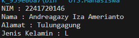
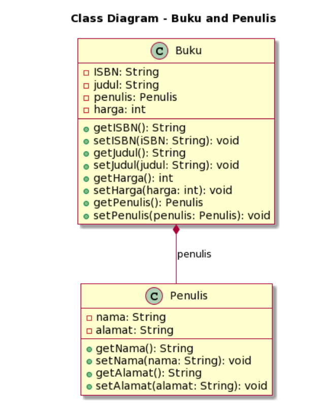
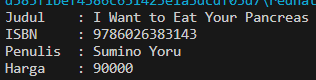

## UTS

### Nama : Andreagazy Iza Amerianto

### NIM : 2241720146

### Kelas : TI-2C/05

### Soal 1: Penulisan Class
<br>Berdasarkan contoh class ClassA di bawah ini, jelaskan apakah penulisan source code pada contoh 
class tersebut sudah benar. Jika tidak, apa yang perlu diperbaiki?

```java
public class ClassA {

    float f1 = 0.15f;
    float hitung() {
        float x = 2f * f1;
 }
}

```

<br>Jawab : Penulisan kode diatas salah karena method tersebut memiliki tipe data float sehingga perlu penambahan return untuk menggembalikan nilai float. Perbaikan yang dilakukan : 
<br>

```java
package UTS;

public class ClassA {
    float f1 = 0.15f;

    float hitung(){
        float x = 2f * f1;
        return x;
    }
}

```

### Soal 2: Perhitungan Jumlah Elemen Array 2 Dimensi
<br>Pada class SoalArray1, terdapat array 2 dimensi dengan ukuran 3x3. Tuliskan code Java untuk 
menghitung jumlah total elemen array tersebut dengan menggunakan perulangan.

```java
public class SoalArray1 {
    public static void main(String[] args) {
        int[][] arrayInt = {{1, 1, 4}, {2, 1, 2}, {3, 2, 1}};
            // hitung jumlah elemen array 2 dimensi
            // gunakan perulangan
 }
}
```

<br>Jawab :
<br>

```java
package UTS;

public class SoalArray1 {
    public static void main(String[] args) {
        int [][] arrayInt = {{1,1,1},{2,1,2},{3,2,1}};
        int total = 0;
        for (int i = 0; i < arrayInt.length; i++) {
            for (int j = 0; j < arrayInt[0].length; j++) {
                total += arrayInt[i][j];
            }
        }

        System.out.println("Jumlah total elemene array adalah "+total);
    }
}
```

### Soal 3: Pewarisan Atribut dan Method
<br>Pada source code yang diberikan, class ClassY merupakan turunan dari class Class. Sebutkan atribut dan method apa saja yang diwarisi oleh ClassY dari kelas induknya (class Class). Jelaskan juga apa output dari code yang ditulis pada class ClassY dan bagaimana nilai tersebut diperoleh.

```java
public class Class {
    int a = 2;
    int x = 0;
    int hitung() {
        x = x + 5 * a;
        return x;
    }
}
public class ClassY extends Class {
    int b = 5;
    int y = 0;
    int hitungY() {
        y = hitung() * b;
        return y;
    }

    public static void main(String[] args) {
        ClassY cy = new ClassY();
            System.out.println(cy.hitungY());
        }
}
```

<br>Jawab : Atribut yang diturunkan Class ke ClassY adalah a dengan nilai 2 dan x dengan nolai 0. Sedangkan method yagng diwariskan adalah method hitung().
<br>Ketika dilakukan print cy.hitungY() maka nilai yang akan muncul adalah 50. Nilai tersebut didapat dari method hitung() yang diwariskan dari Class yang menghasilkan nilai 10, kemudian masuk pada method hitungY() yang dimana y adalah hasil perkalian nilai method hitung() dan b sehimgga 10 * 5 = 50.


### Soal 4: Class Mahasiswa dengan Constructor
<br>Dalam class Mahasiswa, lengkapi code dengan:
<br>a. Menambahkan constructor untuk mengisi atribut nim, nama, alamat, dan jenisKelamin.
<br>b. Membuat objek mahasiswa dan mengisi atribut nim, nama, alamat, dan jenisKelamin melalui constructor.

```java
public class Mahasiswa {
    String nim, nama, alamat;
    char jenisKelamin;
 
        // a. Tambahkan constructor
        // Gunakan constructor untuk
        // mengisi atribut nim, nama, alamat, jenisKelamin
 
    public static void main(String[] args) {
        // b. Buat objek mahasiswa
        // Isi atribut nim, nama, alamat, jenisKelamin
        // lewat constructor
    }
}
```

<br>Jawab : Disini saya melakukan print dari atributnya juga sehingga menghasilkan output
<br> 
<br>

```java
package UTS;

public class Mahasiswa {
    String nim, nama, alamat;
    char jenisKelamin;

    Mahasiswa(){

    }
    Mahasiswa(String nim , String nama, String alamat, char jenisKelamin){
        this.nim = nim;
        this.nama = nama;
        this.alamat = alamat;
        this.jenisKelamin = jenisKelamin;
    }

    public static void main(String[] args) {
        Mahasiswa mhs = new Mahasiswa("2241720146", "Andreagazy Iza Amerianto", "Tulungagung", 'L');
        System.out.println("NIM : " + mhs.nim);
        System.out.println("Nama : " + mhs.nama);
        System.out.println("Alamat : " + mhs.alamat);
        System.out.println("Jenis Kelamin : " + mhs.jenisKelamin);
        
    }
}
```


### Soal 5: OOP Buku -> Penulis
<br>Perhatikan class diagaram berikut dan Buatlah Source code dalam Bahasa java berdasarkan class diagram tersebut
<br>

<br>Jawab :
<br> 


<b><br>Penulis.java</b>

```java
package UTS;

public class Penulis {
    private String nama,alamat;
    public String getNama() {
        return nama;
    }
    public void setNama(String nama) {
        this.nama = nama;
    }
    public String getAlamat() {
        return alamat;
    }
    public void setAlamat(String alamat) {
        this.alamat = alamat;
    }
}

```

<b><br>Buku.java</b>

```java
package UTS;

public class Buku {
    private String ISBN, judul;
    private Penulis penulis;
    private int harga;

    public String getISBN() {
        return ISBN;
    }
    public void setISBN(String iSBN) {
        ISBN = iSBN;
    }
    public String getJudul() {
        return judul;
    }
    public void setJudul(String judul) {
        this.judul = judul;
    }
    public int getHarga() {
        return harga;
    }
    public void setHarga(int harga) {
        this.harga = harga;
    }
    public Penulis getPenulis() {
        return penulis;
    }
    public void setPenulis(Penulis penulis) {
        this.penulis = penulis;
    }

}
```

<b><br>BukuMain.java</b>

```java
package UTS;

public class BukuMain {
    public static void main(String[] args) {
        Penulis p1 = new Penulis();
        Buku b1 = new Buku();

        p1.setNama("Sumino Yoru");
        p1.setAlamat("Japan");

        b1.setISBN("9786026383143");
        b1.setJudul("I Want to Eat Your Pancreas");
        b1.setPenulis(p1);
        b1.setHarga(90000);

        System.out.println("Judul\t : " +b1.getJudul());
        System.out.println("ISBN\t : "+b1.getISBN());
        System.out.println("Penulis\t : "+b1.getPenulis().getNama());
        System.out.println("Harga\t : "+b1.getHarga());
    }
}

```
